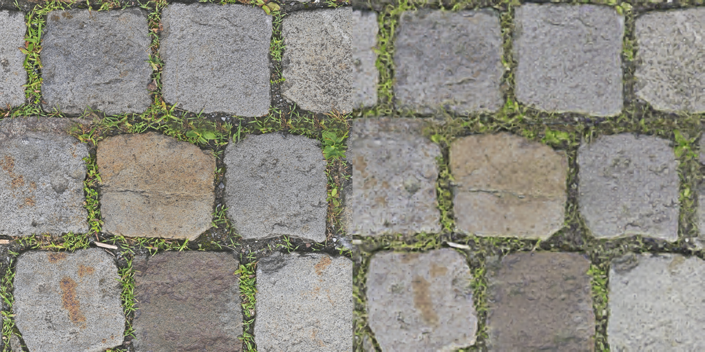
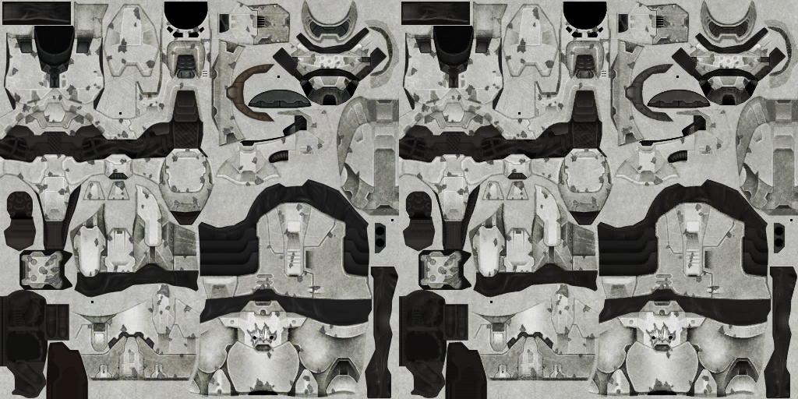
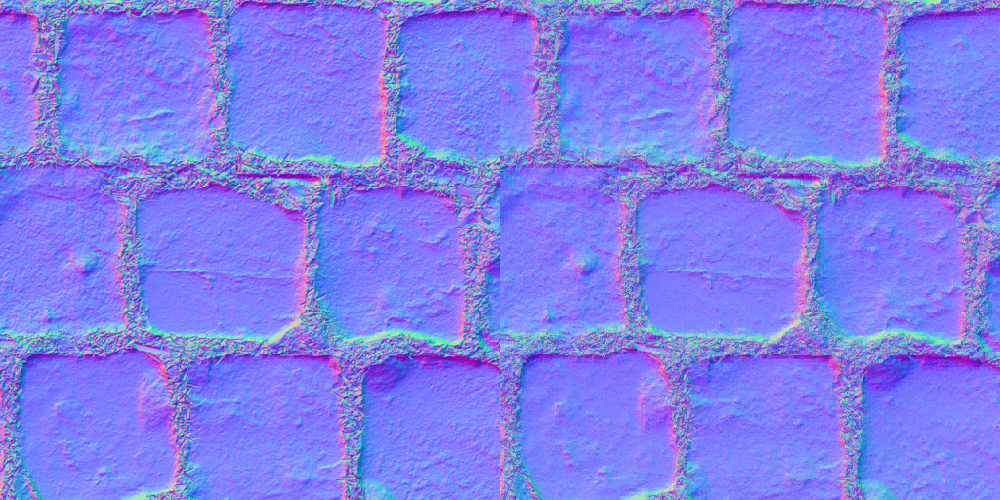
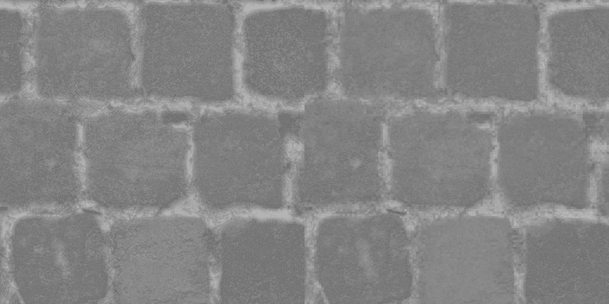
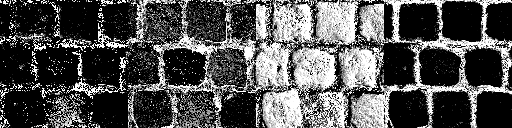

# Neural block texture compression trained with Evolution Strategies (ES)

_Code, README, and public Prior Art disclosure By Richard Geldreich, Jr., September 5, 2026, email: richgel99 at gmail.com, X: https://x.com/richgel999/_

Note the example/test .PNG images in this repo are not covered by the [Unlicense](https://unlicense.org/), which applies to all the other files: source code, build scripts, this README etc.

A small, self-contained C++ testbed: an RGB image (or up to four same-size
RGB textures of one material) is encoded as a shared low-resolution latent
texture plus a tiny MLP decoder, and both are trained
**entirely with Evolution Strategies** — no backprop, no autodiff, no
training framework. (An optional late-training polish, `--mlp-fd`, switches
the decoder to numerical finite differences; still no backprop.) Dependencies are `stb_image`, `stb_image_write`, and OpenMP.

Write-up: [Fitting a neural texture decoder with ES](https://richg42.blogspot.com/2026/09/fitting-neural-texture-decoder-with-es.html)

```
I(u,v) ≈ MLP( bilinear(Z, u, v), phi(u,v) )
```

`Z` is the latent texture, `phi` a small positional encoding. At decode time
each pixel bilinearly samples `Z` at its UV, appends `phi`, and runs the MLP.
An optional second, coarser latent level (`--latent2`) is sampled at the same
UV and its channels are concatenated onto the first level's. Either level can
instead be sampled nearest-neighbor (`--filter`), which turns it into a block
format; with `--qat B` the first level becomes a per-pixel B-bit selector
chosen by exhaustive search (see [A learned block format](#a-learned-block-format)).

## Results

**How bitrates are reported.** Every run prints three bitrates, and the
tables in this file quote the first two. *Raw* is the fixed rate: a selector
level at its `--qat` depth, a `--qes` level at its `--qes` depth, every other
latent level at `--qbits` (default 8) plus a 64-bit min/max header per
channel of each quantized-after-training or `--qes` level, and the MLP
weights as fp16. *Entropy coded* is the same total with every quantized
level charged the zeroth-order entropy of its symbols (grid indices for the
discrete levels). Since September 6, 2026 a third figure charges the level-0
selector planes their conditional entropy given the upper and left
neighbours (the full symbol values as the context, per channel; levels after
the first stay zeroth order): the ceiling of an adaptive arithmetic coder
with an order-2 (up, left) context model. Nothing is actually coded; the
model file stores the values as they are.

**Bit-packed container (`--write-ntcb`).** Since September 7, 2026 the raw
figure can be checked against a real file: with `--write-ntcb` the trainer
also writes `<out>/model.ntcb`, a fixed-width container with no entropy
coding ([NTCB_PLAN.md](NTCB_PLAN.md) section 1, [NTCB_NOTES.md](NTCB_NOTES.md)): a small header, then one
section per latent level holding exactly the bits the raw figure charges (a
`--qat` level its B-bit palette indices, a `--qes` level or a post-hoc
quantized level its B-bit grid indices with the per-channel min/max as
side-info, a `--dct-q` level its 4-bit scale codes and the DC / (run, |q|−1,
sign) / EOB tokens of the bit simulator at their fixed widths) and one
section of fp16 MLP weights (section coding 0 = raw binary16). Under the
flag the final MLP weights are rounded to fp16 once, before the last decode,
so the last progress line, `model.bin`, `recon_q_final.png`, the `done:`
line and the container all describe the same decoder. The rounding is
printed as an `ntcb :` line with the PSNR before and after it; in the logs
so far the change is below two decimals (the regression command: `psnr
23.83 -> 23.83 dB`, its iteration-200 mse 269.314 -> 269.324; the dct50
conversion `45.64 -> 45.64 dB`; the 4-texture material `29.40 -> 29.40 dB`),
and every figure printed after that line is post-rounding. Before `done:`
the trainer prints a `file:` line: the file size in bytes and bpp (over the
WxH decode size, as every bpp in the log) next to the simulator's raw bpp,
the container's content bits against the simulator's raw latent + MLP bits
(`[OK]` only when they are equal exactly; a `MISMATCH` exits 1), the
container's own overhead (header, section headers, six-bit sync markers,
byte padding) and `self-check OK` (the writer re-reads its own bytes through
the reader path and compares them with the state it wrote). The header
carries an FNV-1a hash of the whole file and the section bodies carry sync
markers at the start and end of every level body, every channel of a DCT
body and the MLP body (the value also encodes the level and channel, so a
marker of the right kind in the wrong section is refused too), so a truncated, edited or bit-shifted file is refused
by name ([NTCB_NOTES.md](NTCB_NOTES.md) sections 3(f) and 9). Both readers accept the file in
place of `model.bin`: `ntc --load model.ntcb` (same options as the run; a
level stored on the post-hoc grid is restored as a frozen grid so the `done:`
line reproduces the writing run's, and `--resave` writes it back as the
continuous level it was) and `ntc_decode model.ntcb`, whose `file     :`
line recomputes the simulator figure from the header and the decoded token
stream and reports the same exact-match verdict (a `MISMATCH` exits 1
there too). The containers written for the runs in [NTCB_NOTES.md](NTCB_NOTES.md) decode
byte-identically with the corresponding `model.bin` and come to 0.001–0.005
bpp more than the raw figure (the header, section headers and markers).

### A 4-layer material

The PavingStones070 material (normal, roughness, albedo, AO; see
[Test images](#test-images)) trained jointly from one shared 128×128×4 +
64×64×4 latent and one 10 → 36 → 36 → 12 MLP (2172 weights), 3000
iterations, learning rate annealed over the second half, per-weight finite
differences for the decoder over the last quarter. 8-bit latent: 2.64 bpp
total, 0.66 bpp per texture. Left is the target, right the reconstruction
from the quantized latent (`out_m1234/`). The training command was

```
ntc m1.png m2.png m3.png m4.png --latent 128 128 4 --latent2 64 64 4 --mlp 36,36 --mlp-pairs 64 --iters 3000 --lr-anneal 0.5 0.05 --mlp-fd 0.75 --out out_m1234
```

| Normal map, 23.2 dB |
|---|
|  |

| Roughness, 31.5 dB |
|---|
|  |

| Albedo, 23.2 dB |
|---|
|  |

| Ambient occlusion, 29.6 dB |
|---|
|  |

`out_m1234/model.bin` is the trained material; evaluate it with
`ntc m1.png m2.png m3.png m4.png --load out_m1234/model.bin --latent 128 128 4 --latent2 64 64 4 --mlp 36,36 --iters 0`.

### A learned block format

All runs in this section: mario_512, 36,36 decoder, 64 MLP pairs, 3000
iterations, learning rates annealed 1× → 0.05× over the second half,
per-weight finite differences for the decoder over the last quarter
(`--mlp 36,36 --mlp-pairs 64 --iters 3000 --lr-anneal 0.5 0.05 --mlp-fd 0.75`),
latent quantized to 8 bits after training unless stated otherwise.

**Nearest sampling.** With `--filter nearest` every pixel of a latent cell
reads the same texel, so a 128×128 latent on a 512×512 image is a 4×4-block
format: 128×128×8 at 8 bits is 64 bits per 4×4 block, 4 bpp, BC1's rate.
Footprints are disjoint, so the ES attribution is exact. The decoder needs a
cell-position feature (`lv1local`, the second level's cell offset) or the whole cell
decodes to one color. Nearest costs a lot against bilinear at the same
bitrate (numbers in [Archived experiments](#archived-experiments-removed-in-v08)).

**A per-pixel level.** Making level 0 one scalar per pixel and level 1 the
block latent (`--latent 512 512 1 --latent2 128 128 4 --filter nearest,nearest --pos lv1local`)
reaches 34.77 dB (34.61 dB at 8 bits) but at 10.11 bpp raw (7.75 entropy
coded), and post-hoc quantization of the trained float level 0 collapses:
24.40 / 10.74 / 9.06 dB at 4 / 2 / 1 bits. The per-pixel values have to be
discrete during training.

**`--qat B`: a per-pixel selector level.** Level 0 is held on a fixed
2^B-value grid in [-1, 1] and updated by an exact exhaustive per-texel
search: each texel is set to the grid value that minimizes the weighted error
over its cell. With nearest sampling each pixel reads one
level-0 texel, so the search is exact, and ties keep the current value, so
the loss never increases. It costs C0·2^B image decodes per search. Level 1
and the MLP train by ES and finite differences as before. The result is a
learned block format: per-pixel B-bit indices plus a per-block latent and a
tiny MLP, the indices chosen the way a BC encoder chooses its indices, the
decoder and the block latent trained by ES. Bitrate charges level 0 at B
bits, with the entropy taken over the grid indices.

**`--qes B`: quantization-aware ES for the continuous levels.** The block
latent (and any other ES-trained level) is otherwise fp32 during training and
quantized to 8 bits per channel only after the fact, which costs 0.10 to 0.46 dB
on the 8000-iteration runs below (measured in
[Quantization-aware training of the block latent](#quantization-aware-training-of-the-block-latent)).
With `--qes B` such a level is held on a
per-channel min/max grid of 2^B values *during* training: the level keeps its
fp32 shadow and Adam state, but every decode in the program (MLP minibatches,
both halves of every latent ES pair, the level-0 selector search, the reported
statistics, the saved file) reads a snapped copy; the ES perturbation is added
to the snapped point and the resulting update is applied to the shadow, the
straight-through estimator, independent of the grid step. The side data is the
64-bit min/max per channel that the post-hoc quantizer already stores. By
default the level trains continuous for the first half of the run
(`--qes-start 0.5`), then the ranges are fitted once from the shadow, frozen,
and the shadow is clamped to them; `--qes-start 0` quantizes from the first
iteration. `--qes B0,B1[,B2]` sets a depth per level (0 = continuous); a
`--qat` level cannot also have `--qes`. Model file v12 stores the per-level
bits and ranges and the snapped values, so `ntc_decode` uses them as they are.

**`--dct-q Q` (experimental, off by default): a DCT-coded selector plane.**
Level 0 (a full-resolution nearest level with 1..4 channels, `--latent 0 0 C`)
stops being a per-texel grid and becomes, per channel, a real-valued plane
reconstructed from quantized 8×8 DCT symbols, the way XUBC7 / XUASTC code BC7 /
ASTC weight planes: the plane is mapped to [0,64], transformed by the
orthonormal DCT, quantized with the JPEG luminance table under libjpeg's
quality scaling (Q = 100: every AC step 1, near lossless; Q = 1: coarsest), a
dead zone with the first-order exemption (`--dct-deadzone 0` replaces it by
plain rounding on every AC: the same `round(d / L)`, `q · L` pair the
first-order coefficients already use, so there is no zero bin and no 1.5-step
reconstruction of |q| = 1), the DC at its own uniform step
(`--dct-dc-step`, independent of Q and shared by the channels) and a per-block
4-bit scale code that the trainer fits once by probing the decoder's
sensitivity to the selector. `--dct-q Q` gives every channel the quality Q,
`--dct-q Q0,Q1[,Q2,Q3]` one per channel (the `--qat B1,B2` convention); each
channel is its own symbol stream with its own scale codes and step tables, the
probe sweeps one channel with the other level-0 channels held at their
current values (a conditional sensitivity, 20 MLP evaluations per block and
channel), and the `dct[c]` / `dct codes[c]` lines of the final block, the
per-channel `(ch a% / b%)` clause of the refit line and `ntc_decode`'s `per
channel` line report each channel; with C > 1 the `nz .../blk` figures count
nonzero ACs per (block, channel); the `dct bits` lines and the progress line's
`bits/blk` are bits per 8×8 block position summed over the channels, while
`dct dc`, `dct blkbits` and `ntc_decode`'s `bits/(blk,ch)` are per (block,
channel); the refit clause's per-channel percentages are fractions of each
channel's own block count (`of N each`). Training is the `--qes`
mechanism with a spatial shadow: the shadow is clamped to [-1,1], every
decode reads the snapped plane, ES perturbs the snapped point and the update
goes to the shadow; the codes are fitted and snapping begins at
`--dct-start` (default 0.5). Because the decoder keeps adapting after the
switch, the codes are refitted every `--dct-refit` iterations (default 500;
0 = fit once and freeze): the probe is re-run on the current decoder, the
codes replaced and level 0 re-snapped from the kept shadow (each block's
rounding re-rolls by at most half a step), with the PSNR before / after and
the fraction of codes that moved on the log line; `--dct-refit-until F`
(default 1.0) stops the refits at F·iters so the last codes settle, and the
file stores the codes of the last refit. A DCT-coded level 0 has no bit depth: it is
charged by a bit simulator over the DC and zigzag run-length symbols (raw
fixed-length, order-0 and previous-position-context figures; nothing is
entropy coded). Model file v14 stores the symbols, the codes and the
quantizer flag (v13, without the flag, still loads); `ntc_decode`
reconstructs the plane with the same strict-FP IDCT; `--cuda` mirrors the
snap (check 7 of `--cuda-check`). `--load <v12> --dct-q Q --dct-lambda 0 --iters 0` is a
fast R-D probe of a trained float-selector model at any Q (codes fitted and
plane snapped at iteration 0, decoder frozen; without `--dct-lambda 0` the
recipe lambda applies and the snap truncates). The per-block map PNGs
(`--dct-map`) colour each 8×8 block by its nonzero-AC count through a fixed
ramp: 0 / 1 / 2 / 3-4 / 5-8 / 9-16 / 17-32 / 33-63 = black / navy / blue /
cyan / green / yellow / orange / white. See [DCT_MVP_PLAN.md](DCT_MVP_PLAN.md) and [DCT_NOTES.md](DCT_NOTES.md).

`--dct-lambda L` (September 7, 2026; [DCT_RATE_PLAN.md](DCT_RATE_PLAN.md), [DCT_NOTES.md](DCT_NOTES.md) section
8) puts a rate proxy into the loss, loss = mse + L · proxy bits / pixel with L
in LSB² per bpp (0 = off: no term, no truncation, no change to any figure or
file byte; the default was 0 until September 8, 2026 and is now the recipe
L = min(0.5, 7.5 S(q)²), see the flag table; the check lines below pin
`--dct-lambda 0` or an explicit L so their figures stand). The proxy is an integer Exp-Golomb cost of the same
tokens the bit simulator counts (run and |q| at 2·⌊log2⌋ + 1 bits each, 1 per
sign, 2 per EOB, the DC excluded), which tracks the order-0 AC bits to within a
few percent on m1 at λ ≤ 80 (`proxy/h0` 0.98-1.02; the `dct rate` line prints
it, and next to it the EOB-excluded ratio); on EOB-dominated streams (texture D,
λ ≥ 320) the fixed 2-bit EOB overcharges an adaptive coder's fraction of a bit
and the first ratio rises to 1.3-3.6. Two parts, both on by
default and selectable with `--dct-rate es | trunc | both`: (A) the latent ES
objective charges the proxy of the *perturbed shadow's* symbols (not the
snapped copy, where the perturbation never crosses a bin edge and the
gradient would be identically zero), attributed to the 64 texels of each
(block, channel) as the mse difference is attributed to a texel's footprint;
(B) at every snap the nonzero ACs are walked from zigzag 63 downward and each
one whose exact distortion increase c² − (c − v)² is below λ_t(k) times its
exact bit saving (run merge and EOB movement included) is zeroed, with
λ_t(k) = L / g_k² from the block's scale-code gain, so one L serves both
parts and the truncation threshold is code-independent in the LSB domain.
The natural scale is λ* ≈ 30 S(q)² (83 at q 30, 333 at q 15); start at
λ*/4 ≈ 7.5 S(q)² (20 at q 30, 80 at q 15, 200 at q 10) and bracket by 2×. The
progress line gains `proxy P (Rx h0ac)` (bits per block position, next to
`bits/blk`, and its ratio to the h0 AC tokens), `trunc N/M` (ACs zeroed by B
in the last snap over the pre-truncation nonzero ACs, with `nz` followed by
`(pre-trunc X)`) and `hits` (the fraction of (block, channel, pair)
evaluations whose bit difference was nonzero: the diagnostic that says A has
a signal); a part left out by `--dct-rate` prints `trunc off` / `hits off`;
the switch / refit lines append `trunc N of M pre-truncation nonzero ACs`;
the final block gains a `dct rate` line and the `done:` line says
`(bit simulator, lambda L)`. λ is a training hyperparameter, not stored in the
file; `--cuda` mirrors both parts (the `dct rate` and `proxy bits` clauses of
`--cuda-check`).

```
ntc mario_512.png --latent 512 512 1 --latent2 128 128 4 --filter nearest,nearest --pos lv1local --qat 2 --mlp 36,36 --mlp-pairs 64 --iters 3000 --lr-anneal 0.5 0.05 --mlp-fd 0.75 --out out_2lv_512c1_128c4_qat2
```

512×512×1 at B bits + 128×128×4 nearest at 8 bits, PSNR of the 8-bit
evaluation:

| Level 0                | PSNR     | bpp (raw) | bpp (entropy coded) |
|------------------------|----------|-----------|---------------------|
| none (128×128×4 only)  | 26.63 dB | 2.10      | 1.74                |
| `--qat 1`              | 28.02 dB | 3.11      | 2.76                |
| `--qat 2`              | 30.76 dB | 4.11      | 3.74                |
| `--qat 3`              | 32.64 dB | 5.11      | 4.72                |
| `--qat 4`              | 33.69 dB | 6.11      | 5.67                |
| float, 8 bits post hoc | 34.61 dB | 10.11     | 7.75                |

For reference, bilinear 128×128×8 with `uv` gives 31.64 dB at 4.06 bpp, so
at BC1's rate the 2-bit selector format is still 0.9 dB behind the plain
bilinear latent, and 1.9 dB ahead of the nearest 128×128×8 block latent
without a selector level (28.89 dB).

The same 2-bit format on the 4-layer material (one shared selector level and
block latent for all four textures):

```
ntc m1.png m2.png m3.png m4.png --latent 512 512 1 --latent2 128 128 4 --filter nearest,nearest --pos lv1local --qat 2 --mlp 36,36 --mlp-pairs 64 --iters 3000 --lr-anneal 0.5 0.05 --mlp-fd 0.75 --out out_m1234_512c1q2_128c4
```

| Material run                        | bpp / texture | Normal   | Roughness | Albedo   | AO       | Total    |
|-------------------------------------|---------------|----------|-----------|----------|----------|----------|
| bilinear 128×128×4 + 64×64×4 (above) | 0.66         | 23.17 dB | 31.48 dB  | 23.22 dB | 29.55 dB | 25.45 dB |
| `--qat 2` 512×512×1 + 128×128×4     | 1.03          | 23.37 dB | 31.61 dB  | 27.26 dB | 31.59 dB | 27.06 dB |
| `--qat 4` 512×512×1 + 128×128×4     | 1.53          | 23.74 dB | 32.10 dB  | 29.41 dB | 33.24 dB | 27.92 dB |
| `--qat 4` 512×512×1 + 128×128×6     | 1.78          | 24.52 dB | 32.82 dB  | 30.05 dB | 33.93 dB | 28.66 dB |

Raw totals 4.13, 6.13 and 7.13 bpp; entropy coded 3.72, 5.62 and 6.17 bpp (0.93,
1.40 and 1.54 per texture). Albedo and AO gain the most from the per-pixel level;
the normal map barely moves.

### Neural block texturing

The format above, run on the GPU with multi-channel selectors of per-channel
bit depth (`--qat B1,B2,...`) and a longer schedule. Every result here was
trained on an RTX 5090 (`--cuda`) except where marked CPU; the two paths
agree to within seed noise (and to display precision when the CPU trainer
draws the same hash noise, `--rng hash`).

Test platform for every result in this section: NVIDIA GeForce RTX 5090
(32 GB, driver 581.80), CUDA 13.1 (nvcc 13.1.80, sm_120), Windows 11 Pro
(build 26200), Visual Studio 2022 Community (MSVC 19.44 / toolset 14.44,
the host compiler for nvcc), CMake 4.1.1; the CPU numbers quoted for
comparison are from the same machine on the CPU: AMD Ryzen 9 9950X (16 cores, 32 threads), 64 GB RAM, same MSVC build.

**The format.** A 4×4 block is a fixed-size record: `B = (c_b, s_0 ... s_15)`.
`c_b` is the block's latent (C1 values at 8 bits, the "block control"), and
each `s_i` is that pixel's selector (C0 small integers of B0 bits each). A
pixel is reconstructed as

```
x_i = f_theta( c_b, s_i, u_i, v_i )
```

by one MLP evaluation from its block latent, its own selector(s) and its
position inside the block (`lv1local`, the 4×4 cell offset in [-1,1]). For a
material `f_theta` emits every texture's channels at once from the same
record. The block latent is trained by ES with footprint attribution, the
selectors are chosen by exact exhaustive search every iteration, the
decoder by ES then per-weight central finite differences. Nothing is
backpropagated.

**Blocks are self-contained packets.** Because the selectors are sampled
nearest and the block latent is one texel per block, everything a block's
16 texels need is in its own record: the 8-bit block values followed by
the 16 packed selectors (48 to 112 bits per block in the runs below). The
records can be stored as a flat array in block order, like BC or ASTC
blocks, and any block can be read and decoded on its own, in any order, in
parallel, with no neighbor access and no latent texture or grid at all.
The "two latent levels" are only how the trainer holds the same data
while it is being optimized; a decoder needs nothing but the packet and
the shared MLP weights.

**Sample: chief1.png** (512×512 game texture), 2-bit selectors and a
2-channel block latent, 48 bits per 4×4 block:

```
ntc chief1.png --cuda --latent 512 512 1 --latent2 128 128 2 --filter nearest,nearest --pos lv1local --qat 2 --mlp 36,36 --mlp-pairs 64 --iters 8000 --lr-anneal 0.5 0.05 --mlp-fd 0.5 --leak 0.0009765625 --out out_chief1_512c1q2_128c2_cuda8k_fd50
```



| | |
|---|---|
| Selectors (level 0) | 512×512×1 nearest, 2 bits per pixel, exhaustive search every iteration (4 image decodes) |
| Block latent (level 1) | 128×128×2 nearest, one texel per 4×4 block, 8 bits per value after training |
| Decoder | 5 → 36 → 36 → 3, 1659 weights, leaky ReLU (slope 1/1024), sigmoid output; inputs = 1 selector + 2 block values + 2 cell coordinates |
| Decoder training | antithetic ES, 64 pairs on 4096-pixel minibatches (sigma 0.02, lr 0.005) for 4000 iterations, then central finite differences over every weight (h = 0.001) for 4000, Adam reset at the switch |
| Latent training | 4 antithetic pairs per iteration on the full image, sigma 0.05, lr 0.02, footprint attribution (level 1 only; level 0 is searched) |
| Schedule | 8000 iterations, both learning rates annealed 1× → 0.05× from iteration 4000 |
| Result | 34.57 dB fp32, 34.53 dB with the block latent at 8 bits |
| Rate | 3.10 bpp raw (2 bpp selectors + 1 bpp block latent + 0.10 bpp MLP), 2.95 bpp entropy coded; 48 bits per block |
| Time | 73 s on an RTX 5090 (about 330 iterations/s in the ES phase, 65/s in the FD phase) |

**Sample: a 4-layer material** (PavingStones070: normal, roughness, albedo,
ambient occlusion, 512×512 each). One block record is shared by all four
textures: two 2-bit selector channels per pixel and a 4-channel block
latent, 96 bits per 4×4 block for the whole stack, and one decoder with 12
outputs reconstructs every texture from the same record.

```
ntc m1.png m2.png m3.png m4.png --cuda --latent 512 512 2 --latent2 128 128 4 --filter nearest,nearest --pos lv1local --qat 2 --mlp 36,36 --mlp-pairs 64 --iters 8000 --lr-anneal 0.5 0.05 --mlp-fd 0.5 --leak 0.0009765625 --out out_m1234_512c2q2_128c4_cuda8k_fd50
```

Original (left) and reconstruction (right) per layer:





The two levels of the shared record: the per-pixel selectors (level 0, the
two 2-bit channels side by side, four gray levels each) and the per-block
latent (level 1, 128×128, four channels side by side):




| | |
|---|---|
| Selectors (level 0) | 512×512×2 nearest, 2 bits per channel (4 bits per pixel), exhaustive search every iteration (8 image decodes), shared by all four textures |
| Block latent (level 1) | 128×128×4 nearest, one texel per 4×4 block, 8 bits per value after training |
| Decoder | 8 → 36 → 36 → 12, 2100 weights; inputs = 2 selectors + 4 block values + 2 cell coordinates; outputs = 3 channels × 4 textures |
| Schedule | 8000 iterations: ES to 4000, central finite differences after, learning rates annealed 1× → 0.05× from 4000 |
| Result (8-bit block latent) | 29.39 dB weighted; normal 25.96 / roughness 33.46 / albedo 29.32 / AO 33.42 dB |
| Rate | 96 bits per block for the stack: 6.13 bpp raw total = 1.53 bpp per texture (5.65 / 1.41 entropy coded) |
| Time | 107 s on the RTX 5090 |

Against three 2-bit selector channels at 3000 iterations (2.03 bpp per
texture, 30.05 dB) this is 0.65 dB lower at three quarters of the selector
bits, and 1.5 dB above a single 4-bit selector channel at the same rate
(27.92 dB), the normal map gaining the most (+2.2 dB) from the second
independent channel.

**Across images and layouts** (all 8000 iterations with the schedule above
unless marked 3k or 6k: 3000 or 6000 iterations with finite differences over
the last quarter; PSNR of the 8-bit evaluation; game2 and frymire are
1024×1024 textures that are not checked in):

| Image | Selectors (bits/px) | Block latent | bits / 4×4 block | bpp raw | bpp entropy | PSNR |
|---|---|---|---|---|---|---|
| game2 1024² (3k) | 2 ch: 3 + 1 | 256×256×4 | 96 | 6.03 | 5.54 | 40.71 dB |
| game2 1024² (3k) | 1 ch: 2 | 256×256×3 | 56 | 3.53 | 2.84 | 36.18 dB |
| game2 1024² | 1 ch: 2 | 256×256×3 | 56 | 3.53 | 3.14 | 37.84 dB |
| game2 1024² | 1 ch: 2 | 256×256×2 | 48 | 3.03 | 2.78 | 36.10 dB |
| game2 1024² | 1 ch: 2 | 256×256×1 | 40 | 2.53 | 2.38 | 32.30 dB |
| chief1 512² | 1 ch: 2 | 128×128×2 | 48 | 3.10 | 2.95 | 34.53 dB |
| model 512² (photo) | 1 ch: 2 | 128×128×2 | 48 | 3.10 | 2.92 | 31.99 dB |
| model 512² (photo) | 1 ch: 2 | 128×128×4 | 64 | 4.11 | 3.80 | 35.04 dB |
| model 512² (photo, 3k) | 2 ch: 3 + 1 | 128×128×4 | 96 | 6.11 | 5.75 | 35.53 dB |
| model 512² (photo, 6k, two seeds) | 2 ch: 3 + 1 | 128×128×4 | 96 | 6.11 | 5.74 / 5.67 | 36.32 / 36.83 dB |
| frymire 1024² | 2 ch: 2 + 2 | 256×256×4 | 96 | 6.03 | 5.54 | 33.18 dB |
| frymire 1024² | 2 ch: 3 + 2 | 256×256×4 | 112 | 7.03 | 6.44 | 34.50 dB |

The 4-layer PavingStones070 material, 3000 iterations, one selector level and
one block latent shared by all four textures (per-texture PSNR of normal /
roughness / albedo / AO, then the weighted total):

| Selectors | Block latent | bpp / texture | Normal | Roughness | Albedo | AO | Total |
|---|---|---|---|---|---|---|---|
| 2 ch × 3 bits | 128×128×4 | 2.03 | 26.06 | 33.49 | 29.93 | 34.22 | 29.67 dB |
| 3 ch × 2 bits | 128×128×4 | 2.03 | 26.76 | 33.34 | 30.06 | 34.03 | 30.05 dB |
| 3 ch × 2 bits (GPU) | 128×128×4 | 2.03 | 26.94 | 32.98 | 30.28 | 34.13 | 30.16 dB |
| 2 ch × 3 bits, normal + roughness only | 128×128×4 | 4.06 | 32.64 | 34.50 | | | 33.47 dB |

What the sweeps say:

* **Selector bits are worth about 2 dB per bit per pixel** through 3 bits
  (mario: 1 / 2 / 3 / 4 bits at 28.0 / 30.8 / 32.6 / 33.7 dB), and more
  independent selector channels beat finer levels at equal bits (3 × 2 bits
  beat 2 × 3 bits by 0.4 dB on the material; 3 + 1 bits beat 2 + 2 by 0.6 dB
  on the photo).
* **Block channels are worth 3.5 to 7.5 dB per bpp** at the bottom of the
  range (game2: 1 / 2 / 3 channels at 32.3 / 36.1 / 37.8 dB for 2.53 / 3.03 /
  3.53 bpp; the photo's 2 → 4 channels: 32.0 → 35.0 dB for 1 bpp), more than
  selector bits buy at the same rate.
* **The finite-difference phase does most of the late work.** The ES-phase
  gains slow to a few tenths of a dB per 1000 iterations; switching to
  per-weight central differences at 50% of an 8000-iteration run gains 2 to
  3.7 dB in its first 1000 iterations (relative to the switch point) and then
  saturates. A decoder with twice the weights (52,52, 3175 weights) did not
  help at all.
* **Half-resolution selectors are a poor trade** (256×256×2 at 2 bits on the
  photo: 29.3 dB at 3.1 bpp against 34.9 dB at 6.1 bpp for full resolution,
  both 3000 iterations).
* Game art with flat regions and clean edges suits the format best; a photo
  is about 2.5 dB harder at the same rate, and frymire (hard outlines and
  dithering) about 7 dB harder than game art at 96 bits per block.

**Decoding.** A shipping decoder reads one 4×4 block record (selectors plus
block latent), runs the MLP once per pixel with the pixel's cell offset, and
writes the texel. The representation need not be sampled during rendering:
it can be decoded at asset load or streaming time and transcoded into
conventional hardware texture formats (BC7, BC5, BC4, ASTC), on the CPU or
the GPU. Both paths, and the option of putting a real block encoder inside
the training objective, are described in the prior-art section below.

#### Quantization-aware training of the block latent

Every result above trains the block latent as fp32 and quantizes it to 8
bits per channel after the run (per-channel min/max, 64 header bits per
channel); the PSNR quoted is that 8-bit evaluation. On the September 6 runs
with a bilinear block latent (8×8 and 6×6 blocks, 27,27 decoders, 256 pairs,
8000 iterations on the GPU) the post-hoc step costs 0.10 to 0.46 dB:
image3 49.32 → 48.86 dB,
texture E 40.54 → 40.35 dB,
image1 43.21 → 43.11 dB
and texture D 41.56 → 41.45 dB.
The trained values are heavy-tailed (image3's block latent ends at sd 1.612
with max |v| 11.05, so the 8-bit step is coarse), and neither the selector
search nor the decoder ever saw the values the shipping decoder receives.

`--qes B` (September 6, 2026, tag `qes-v1`) makes the level
quantization-aware without changing the estimator. The level keeps an fp32
shadow, trained by ES with the footprint attribution and the Adam state as
before, and the trainer maintains a snapped copy of it on a per-channel
min/max grid of 2^B values. Every decode in the program reads the snapped
copy: the MLP ES and finite-difference minibatches, both halves of every
latent ES pair, the level-0 selector search, the printed statistics,
`recon_q_final.png` and the saved file. The ES perturbation is added at the
snapped point and the resulting update is applied to the shadow, so the
estimate is the gradient of the continuous loss at the quantized point
(the straight-through estimator); it does not depend on the grid step, so
no dithering and no change to the perturbation scale is needed, and the shadow
accumulates sub-step movement until it crosses a cell boundary. The
per-channel min/max ranges are the side data the post-hoc quantizer already
stores (64 bits per channel): they are fitted from the shadow at
`--qes-start` (default 0.5, so the first half of the run trains exactly as
without the flag), frozen from then on, and the shadow is clamped to them
after every step. The mechanism applies to any continuous
(ES-trained) level: level 1, a `--latent3` level, and level 0 when `--qat`
is off, so level 0 has two mutually exclusive options, `--qat B` (exhaustive
per-texel search on a fixed grid in [-1, 1]) or `--qes B` (snap-then-perturb
ES on a min/max grid); a `--qat` level cannot also have `--qes`. Model file
v12 stores, per level, the `--qes` bit depth and the per-channel ranges, and
a `--qes` level as its on-grid values, so `ntc_decode` skips its post-hoc
quantization on such levels (`--q8` and `--fp32-latent` then decode the
same values). On the GPU the snap is one kernel after the Adam step,
reading a grid table computed on the host; `--cuda-check` compares the
device copy with the host snap of the downloaded shadow exactly.

The experiment: image3 (1478×1424, padded to 1480×1424 for 8×8 blocks; not
checked in), one 4-bit selector per pixel and a bilinear 185×178×4 block
latent (one texel per 8×8 block), decoder 7 → 27 → 27 → 3 = 1056 weights
(inputs: 1 selector + 4 block values + 2 cell coordinates), 256 MLP pairs,
finite differences and annealing from iteration 4000, the block-latent
ranges fitted at iteration 4000. The options below are those of the log
header; the 6- and 10-bit runs use `--qes 6` / `--qes 10`:

```
ntc image3.png --cuda --block 8 --latent 0 0 1 --latent2 0 0 4 --filter nearest,bilinear --pos lv1local --qat 4 --qes 8 --mlp 27,27 --iters 8000 --lr-anneal 0.5 0.05 --mlp-fd 0.5 --leak 0.0009765625 --out out_image3_b8_c1q4_c4bilin_qes8_mlp27_cuda8k_fd50
```

| Block latent (185×178×4) | PSNR | bpp (raw) | bpp (entropy coded) | Time |
|---|---|---|---|---|
| fp32, not quantized | 49.32 dB | 34.016 | — | 142.0 s |
| 8 bits post hoc (baseline) | 48.86 dB | 4.508 | 4.088 | 142.0 s |
| `--qes 6`, quantization-aware | 48.54 dB | 4.383 | 4.063 | 143.6 s |
| `--qes 8`, quantization-aware | 49.29 dB | 4.508 | 4.146 | 141.6 s |
| `--qes 10`, quantization-aware `*` | 49.31 dB | 4.633 | 4.231 | 142.9 s |

`*` the latest run. The first two rows are the same run; the other three
are separate runs at 6, 8 and 10 bits. On 8×8 blocks
each block-latent channel bit costs 1/64 bpp, so the 4-channel latent moves
the raw rate by 0.125 bpp per bit (4.383 / 4.508 / 4.633 at 6 / 8 / 10 bits).

Quantization-aware training at 8 bits recovers all but 0.03 dB of the
0.46 dB post-hoc loss at the same raw rate (49.29 dB against 48.86 post hoc
and 49.32 fp32), at no cost in wall time. 10 bits buys a further 0.02 dB
for 0.125 bpp; 6 bits gives back 0.75 dB for the same 0.125 bpp saved, so 8
bits is the point for this layout. The zeroth-order entropy of the
quantization-aware 8-bit latent is 0.058 bpp higher than the post-hoc one
(4.146 against 4.088). With the 4-bit selector planes charged their (up,
left) conditional entropy the three `--qes` runs total 1.351 / 1.295 /
1.353 bpp (the baseline log predates that figure). Once every level is
discrete the run's fp32 and quantized PSNRs coincide, so the number printed
is the decoded number.

### DCT-coded selectors, the rate proxy and the packed container

September 6-8, 2026. The full-resolution level-0 plane of the format above
(the "selectors") gained a second storage mode: instead of B-bit integers
chosen by exhaustive search, the plane is coded as 8×8 DCT blocks, trained
through the quantizer by ES with a rate term in the objective, and written
with everything else into a bit-packed container that a standalone CPU
decoder reads. Every number in this section is from a log in the tree
(`out_<dir>.log` for training, `out_<dir>/ntcb_decode.log` for the decoder),
every run is on the GPU of the previous section, and the PSNR quoted is the
one the standalone decoder measures on the packed file (Basis Universal's
definition: 8-bit decoded against the 8-bit source over the source extent),
never the trainer's. [PROGRESS.md](PROGRESS.md) is the summary; [DCT_NOTES.md](DCT_NOTES.md) sections 7-9,
[DCT_RATE_PLAN.md](DCT_RATE_PLAN.md), [BATTERY_NOTES.md](BATTERY_NOTES.md) and [NTCB_NOTES.md](NTCB_NOTES.md) sections 8-10 hold the
verification transcripts.

**The DCT plane (`--dct-q Q`).** Level 0 (1-4 channels, nearest sampled,
full resolution) is transformed in 8×8 blocks and quantized with the JPEG
luma table K.1 under libjpeg's quality scaling (a deliberate, conservative
psychovisual prior), a DC step of 4 in the plane's DC units independent of
q, and a per-block 4-bit scale code: the block's coefficients are perturbed,
the decoded-image error is measured, and blocks the decoder is sensitive to
get finer steps. The codes are fitted when the plane switches to its
quantized form at 50% of the run and refitted every 500 iterations
(`--dct-refit 500`). Every AC is plainly rounded (`--dct-deadzone 0`, the
default since v0.12.3; 1 is the XUASTC dead zone, which reconstructs |q| = 1
at 1.5 steps and produced mosquito noise). With `--latent 0 0 C` and a q
list each of the C channels has its own q, step tables, scale codes and
symbol stream (`--dct-q 80,80` is the normal-map layout below).

**Training through the quantizer.** The plane is trained by ES on an fp32
"shadow": each perturbation is added to the shadow, the perturbed shadow is
snapped through the DCT quantizer, the decoder sees the snapped plane, and
the update goes to the shadow (snap-then-perturb, as `--qes` does for the
block latent). Two additions on September 8, 2026 made this reliable.
Coefficients below their quantizer step have no error gradient, and Adam
turns the noise gradient into fixed-size steps, so they random-walked until
they crossed the step and appeared in the plane at full amplitude; the
**shadow pull** (`--dct-shadow-pull 0.01`, now the default: each latent step
moves the shadow 1% toward its own snapped plane) lets them decay instead.
The **luma start** (`--lat-init-image`: channel 0 of level 0 begins as the
image luma scaled to [-1, 1] instead of Gaussian noise) removes the seed
variance of the float phase.

**The rate proxy (`--dct-lambda L`).** The latent ES objective becomes
`mse + L · proxy bits / pixel`, where the proxy is the integer Exp-Golomb
cost of the tokens the bit simulator counts (run, |q|, sign, end-of-block),
evaluated on the perturbed shadow's snapped symbols, so the ES itself trades
distortion against bits; at snap time every trailing nonzero AC whose exact
distortion increase is below `L / g_k²` times its bit saving is zeroed
(truncation). The first-order pair (0,1), (1,0) is charged 0.25 of its bits
(`--dct-lambda-lo 0.25`) so edges survive. The ES term carries the effect
and the truncation barely moves the rate. L must stay small: the recipe
`L = min(0.5, 7.5 S(q)²)`, S the libjpeg scale (50/q below 50, 2 − q/50
above), gives 0.5 up to q ~87, 0.3 at q 90, 0.075 at 95 and 0 at 100, and
since September 8, 2026 (evening) the trainer applies it when `--dct-lambda`
is absent; larger values damage edge coefficients at low q and flat blocks
at mid q in ways PSNR does not show.

**config_a.** The settings every row below uses unless its row says
otherwise: level 1 at 1/6 with 4 channels, 8-bit and bilinear (`--block 6
--latent2 0 0 4 --qes 0,8`), a 1-channel DCT plane, decoder 7 → 17 → 17 → 3
= 496 weights (`--mlp 17,17`; inputs: the selector, the 4 block values and
the cell-local UV), 8000 iterations, luma start, shadow pull, the recipe
lambda. The directory token `_lam<L>` records the lambda that applied
(`lam0p5` at q 80, `lam0p3` at q 90, `lam0p003` at q 99); `_init` = the luma
start; `_pull01` marks the runs made while the pull was still an explicit
flag.

```
build_cuda\Release\ntc.exe <image> --cuda --block 6 --latent 0 0 1 --latent2 0 0 4 --filter nearest,bilinear --pos lv1local --dct-q Q --dct-refit 500 --qes 0,8 --mlp 17,17 --mlp-pairs 256 --iters 8000 --lr-anneal 0.5 0.05 --mlp-fd 0.5 --leak 0.0009765625 --dct-map all --lat-init-image --write-ntcb --out out_<image>_b6_dct<Q>_c4_mlp17_lam<L>_init_8k
build\Release\ntc_decode.exe <dir>\model.ntcb -o <dir>\ntcb_decoded --compare <image>
```

**Three worked examples on images in this repository** (every figure from
the run's log and the decoder's `compare` line on its packed file; the
commands are config_a with the defaults of the current binary, so the
`--dct-lambda 0.5` and `--dct-shadow-pull 0.01` the logged runs passed
explicitly are no longer written):

1. frymire (1032×1032 padded, the stress test) with the DCT plane at q 80:
   32.99 dB at 9.673 bpp raw, 4.052 order-0, 3.965 est, 3.826 ctx; 29.1 s.

```
build_cuda\Release\ntc.exe frymire.png --cuda --block 6 --latent 0 0 1 --latent2 0 0 4 --filter nearest,bilinear --pos lv1local --dct-q 80 --dct-refit 500 --qes 0,8 --mlp 17,17 --mlp-pairs 256 --iters 8000 --lr-anneal 0.5 0.05 --mlp-fd 0.5 --leak 0.0009765625 --dct-map all --lat-init-image --write-ntcb --out out_frymire_b6_dct80_c4_mlp17_lam0p5_init_8k
build\Release\ntc_decode.exe out_frymire_b6_dct80_c4_mlp17_lam0p5_init_8k\model.ntcb -o out_frymire_b6_dct80_c4_mlp17_lam0p5_init_8k\ntcb_decoded --compare frymire.png
```

2. chief1 (516×516 padded) with the DCT plane at q 50: 34.71 dB at 5.152 bpp
   raw, 2.332 order-0, 2.320 est, 2.198 ctx; 15.1 s (this and the two other
   examples were re-run from this repository's build; the chief1 q 50 run
   quoted elsewhere at 31.77 dB predates the shadow-pull default).

```
build_cuda\Release\ntc.exe chief1.png --cuda --block 6 --latent 0 0 1 --latent2 0 0 4 --filter nearest,bilinear --pos lv1local --dct-q 50 --dct-refit 500 --qes 0,8 --mlp 17,17 --mlp-pairs 256 --iters 8000 --lr-anneal 0.5 0.05 --mlp-fd 0.5 --leak 0.0009765625 --dct-map all --lat-init-image --write-ntcb --out out_chief1_b6_dct50_c4_mlp17_lam0p5_init_8k
build\Release\ntc_decode.exe out_chief1_b6_dct50_c4_mlp17_lam0p5_init_8k\model.ntcb -o out_chief1_b6_dct50_c4_mlp17_lam0p5_init_8k\ntcb_decoded --compare chief1.png
```

3. chief1 with the searched, quantization-aware selector plane instead
   (`--qat 3`: 3 bits per texel chosen by exhaustive per-texel search every
   iteration, the block latent 8-bit aware through `--qes 0,8`; no DCT
   flags): 38.53 dB at 3.920 bpp raw, 3.812 order-0, 3.795 est, 2.803 ctx;
   15.3 s. The searched plane costs more than the DCT plane at the same
   cell size but its errors are per texel and it wins on this fine-detail
   image by 6.8 dB.

```
build_cuda\Release\ntc.exe chief1.png --cuda --block 6 --latent 0 0 1 --latent2 0 0 4 --filter nearest,bilinear --pos lv1local --qat 3 --qes 0,8 --mlp 17,17 --mlp-pairs 256 --iters 8000 --lr-anneal 0.5 0.05 --mlp-fd 0.5 --leak 0.0009765625 --lat-init-image --write-ntcb --out out_chief1_b6_qat3_c4_mlp17_init_8k
build\Release\ntc_decode.exe out_chief1_b6_qat3_c4_mlp17_init_8k\model.ntcb -o out_chief1_b6_qat3_c4_mlp17_init_8k\ntcb_decoded --compare chief1.png
```

**Rates.** The `done:` line of every log prints four figures, the
container's byte count agrees with the first, and the decoder log repeats
it as its `file :` line. **raw**: the packed file on disk (fixed-width
fields, no entropy coding). **order-0**: the level-0 tokens, the level-1
grid indices and the MLP under an adaptive order-0 coder. **est**: level 0
order-0 plus lossless DPCM (floor((left + up) / 2)) residuals of the block
latent order-0 plus the fp16 MLP: the figure a plain real coder reaches.
**ctx**: level 0 under an (up, left) context; a ceiling, not part of est.
All are per texel of the padded (multiple of lcm(N, 8)) image; the PSNR is
over the source extent (`853×1280` for the `864×1296` models below).

Of the images in this table only frymire and chief1 are in the repository
(the test images shipped here are chief1, frymire, game1, game2, kodim01,
kodim02, kodim23, m1-m4 and mario_512); the others are game textures
(labelled texture A to K) and photos that cannot be redistributed. The PSNR column is the standalone
decoder's figure on the packed file; the rates and the time are the
trainer's `done:` line.

| Image | Size (padded) | Plane | Level 1 | Decoder | PSNR (decoder) | raw | order-0 | est | ctx | Train |
|---|---|---|---|---|---|---|---|---|---|---|
| texture F | 864×1296 | 1 ch, q 80 | 1/6 × 4 | 7-17-17-3 = 496 | 43.92 dB | 4.523 | 2.039 | 1.856 | 1.959 | 30.5 s |
| texture B | 1280×800 | 1 ch, q 80 | 1/4 × 4 | 7-17-17-3 = 496 | 45.87 dB | 4.293 | 2.560 | 2.035 | 2.485 | 28.5 s |
| texture B | 1280×800 | 1 ch, q 99 | 1/4 × 4 | 7-17-17-3 = 496 | 49.23 dB | 8.923 | 4.135 | 3.599 | 3.932 | 29.3 s |
| image4 (photo) | 1600×1200 | 1 ch, q 80 | 1/8 × 3 | 6-17-17-3 = 479 | 42.78 dB | 3.412 | 1.314 | 1.224 | 1.233 | 46.0 s |
| image4 (photo) | 1600×1200 | 1 ch, q 20 | 1/8 × 3 | 6-17-17-3 = 479 | 39.93 dB | 1.201 | 0.583 | 0.504 | 0.563 | 44.2 s |
| image4 (photo) | 1608×1200 | 1 ch, q 80 | 1/6 × 4 | 7-17-17-3 = 496 | 42.67 dB | 3.308 | 1.524 | 1.332 | 1.465 | 46.9 s |
| chroma | 528×528 | 1 ch, q 30 | 1/6 × 2 | 5-17-17-3 = 462 | 33.05 dB | 3.111 | 1.353 | 1.281 | 1.245 | 14.6 s |
| image5 | 416×416 | 1 ch, 3-bit search (`--qat 3`) | 1/4 × 3 | 6-17-17-3 = 479 | 47.48 dB | 4.545 | 4.261 | 3.877 | 2.946 | 11.7 s |
| image5 | 416×416 | 1 ch, q 80 | 1/4 × 3 | 6-17-17-3 = 479 | 44.66 dB | 4.455 | 2.530 | 2.187 | 2.385 | 12.7 s |
| frymire | 1032×1032 | 1 ch, q 80 | 1/6 × 4 | 7-17-17-3 = 496 | 32.99 dB | 9.673 | 4.052 | 3.965 | 3.826 | 29.1 s |
| zone | 3000×2016 | 1 ch, q 80 | 1/6 × 4 | 7-17-17-3 = 496 | 36.47 dB | 10.194 | 4.408 | 4.436 | 4.276 | 126.4 s |
| doom | 1920×1080 | 1 ch, q 70 | 1/6 × 4 | 7-17-17-3 = 496 | 39.71 dB | 3.880 | 1.836 | 1.665 | 1.771 | 46.3 s |
| texture I | 936×936 | 1 ch, q 90 | 1/6 × 4 | 7-17-17-3 = 496 | 43.88 dB | 6.646 | 3.290 | 3.166 | 3.042 | 24.8 s |
| texture J | 960×960 | 1 ch, q 80 | 1/6 × 4 | 7-17-17-3 = 496 | 40.48 dB | 3.609 | 1.901 | 1.786 | 1.836 | 25.0 s |
| texture K | 960×960 | 1 ch, q 80 | 1/6 × 4 | 7-17-17-3 = 496 | 40.84 dB | 6.027 | 2.586 | 2.486 | 2.412 | 26.0 s |
| texture H | 864×1296 | 1 ch, q 80 | 1/6 × 4 | 7-17-17-3 = 496 | 41.94 dB | 4.876 | 2.282 | 2.097 | 2.163 | 29.1 s |
| texture H | 864×1296 | 1 ch, q 80 | 1/6 × 4 | 7-11-11-3 = 256 | 39.42 dB | 4.486 | 1.972 | 1.806 | 1.874 | 22.7 s |
| texture H | 864×1296 | 1 ch, q 80 | 1/6 × 4 | 7-7-7-3 = 136 | 40.56 dB | 4.684 | 2.116 | 1.970 | 1.998 | 19.1 s |
| normal_map | 512×512 | 2 ch, q 80,80 | 1/4 × 4 | 8-17-17-3 = 513 | 38.99 dB | 11.007 | 5.151 | 5.060 | 4.822 | 19.0 s |
| normal_map | 512×512 | 2 ch, q 50,50 | 1/4 × 4 | 8-17-17-3 = 513 | 35.44 dB | 7.757 | 3.832 | 3.748 | 3.646 | 18.7 s |
| normal_map | 512×512 | 2 ch, q 25,25 | 1/4 × 4 | 8-17-17-3 = 513 | 33.30 dB | 5.942 | 3.150 | 3.071 | 3.037 | 17.5 s |

Rates are bpp; "Train" is the wall time of the 8000 GPU iterations from
the `done:` line. The texture F
row is the config_a reference: 633,138 bytes on disk for 853×1280 texels.

**Decoder timings** (`ntcb_decode.log`; SSE4.1, 32 threads on the CPU of
the previous section; the `fast` row times the quantized latent in memory
to RGB8 in memory, latent fetch + MLP + fast sigmoid + pack, and excludes the
inverse DCT, file load and PNG encode):

| Run | Inverse DCT of the plane | Decode, min ms | Mtexel/s |
|---|---|---|---|
| texture F q 80 (864×1296, 17,496 blocks) | 6.58 ms single-threaded | 2.614 | 428.35 |
| texture I q 90 (936×936, 13,689 blocks) | 0.85 ms on 32 threads | 1.309 | 669.08 |
| zone q 80 (3000×2016, 94,500 blocks) | 43.20 ms single-threaded | 9.247 | 654.03 |

The inverse-DCT column is each log's `idct :` line as printed (the
single-threaded figures are from the earlier decoder build).

**What was learned.**

- The rate proxy works through the ES term, not the truncation. At the
  recipe lambda it beat lambda 0 on both axes at every q from 15 to 80 on
  five of six battery images ([BATTERY_NOTES.md](BATTERY_NOTES.md)), e.g. image3 q 50: 45.24 →
  46.28 dB at 0.794 → 0.663 bpp order-0. Lambda 0.5 is the cap.
- Plain rounding beats the XUASTC dead zone on this plane (texture G q 50:
  36.85 vs 35.95 dB; q 80: 38.42 vs 37.63; texture C q 95, good basin: 40.47
  vs 39.82).
- The small decoder regularises the plane: with 1056 weights (27,27) the
  plane grows a per-block structure the decoder exploits through its
  cell-UV input and the DCT codes badly; with 496 it stays smooth (texture F
  6×6 q 80: 42.26 vs 37.77 dB at less rate). Below that the trend is not
  monotone: texture H gives 41.94 / 39.42 / 40.56 dB at 496 / 256 / 136
  weights.
- The float phase can land in bad basins (texture C 1/4 q 95: seeds 35.19 /
  39.82 / 35.07; texture F q 80 seed 2: 37.42 vs 42.26). The luma start fixed
  every bad seed tried (texture F seed 2 → 41.34, texture C seeds 1 / 3 → 40.03
  / 40.30) and makes seeds agree within 0.1 dB.
- The shadow pull: texture A 1/4 3-ch q 25 32.16 → 34.43 dB (1.595 → 1.686
  est), q 50 33.78 → 36.28 (2.001 → 2.016), image4 q 20 38.31 → 39.93,
  texture F q 80 41.42 → 43.92 (1.945 → 1.856), texture C q 95 37.99 → 38.34;
  pull 0.02 equals 0.01, 0.05 starts to cost, the reset alone
  (`--dct-shadow-reset`) gives half the gain.
- Cell size sets the rate, q sets the plane: texture D q 30 lambda 60 at 1/4
  / 1/6 / 1/8 gives 38.28 dB @ 1.847 / 37.12 @ 1.019 / 36.48 @ 0.700 bpp
  order-0. On the photo (image4) 1/8 cells with 3 channels beat 1/6 with 4
  on both axes (42.78 @ 1.224 est vs 42.67 @ 1.332).
- The block latent is close to white: its 8-bit indices carry ~7.6 bits of
  entropy each on the game textures, so DPCM gains little there (est is
  close to order-0 in the table) and more on the photo (image4 q 80: 1.314
  order-0 → 1.224 est). It gets cheaper by being trained cheaper, not by
  coding.
- Both level-0 modes ship. Searched bits cost more but the errors are
  per-texel and predictable and win on fine detail (chief1 1/6: 1-bit search
  31.55 dB @ 1.807 est vs DCT q 50 31.77 @ 2.137; 3-bit 38.53 @ 3.795;
  image5 above: 3-bit 47.48 @ 3.877 vs q 80 44.66 @ 2.187). PSNR overstates
  the visual gap; DCT errors are perceptual.

**The container (`--write-ntcb`) and `ntc_decode`.** `model.ntcb` is the
bit-packed file of [NTCB_PLAN.md](NTCB_PLAN.md): a header with a whole-file hash, one
fixed-width section per latent level (8-bit grid indices, searched selector
palettes, or the DCT tokens as DC / run / magnitude / sign / EOB), the MLP
in fp16, and 6-bit sync markers that encode section kind, level and channel;
the trainer reconciles the written bit count against its bit simulator
exactly (`file:` line, `[OK]`) and re-reads the file (`self-check OK`), and
27 layouts (every quantization mode, 1-4 textures, 2-3 levels, cell sizes
4-32, both backends) round-trip byte-identically. The standalone SSE4.1
decoder reads nothing but the file:

```
build\Release\ntc_decode.exe out_frymire_b6_dct80_c4_mlp17_lam0p5_init_8k\model.ntcb -o out_frymire_b6_dct80_c4_mlp17_lam0p5_init_8k\ntcb_decoded --compare frymire.png
```

writes `ntcb_decoded.png` at the source size and prints the `compare t0:`
line the PSNR column above is taken from.

## Archived experiments (removed in v0.8)

The following options were implemented, measured and removed in v0.8 (last
version with the code: tag `pre-v0.8-removal`). The numbers stay as negative
results; the logs named remain in the repository root; the options no longer
exist.

### Original single-level results (`uv,fourier:1`)

Needs `--pos uv,fourier:1` (`--nfreq 1`), removed; the `out_128c8` sample
directory and its legacy-format model file were deleted with it.

512×512 center crop of kodim23 (`--crop 512`, the default at the time), 3000
iterations, latent quantized to 8 bits after training, MLP weights counted as fp16:

| Latent      | PSNR    | bpp (raw) | bpp (entropy coded) |
|-------------|---------|-----------|---------------------|
| 64×64×4     | 26.9 dB | 0.56      | 0.47                |
| 64×64×8     | 28.2 dB | 1.07      | 0.87                |
| 128×128×4   | 30.3 dB | 2.06      | 1.65                |
| 128×128×8   | 32.2 dB | 4.07      | 3.27                |

These runs used the original positional encoding `uv,fourier:1` (`--nfreq 1`);
the `uv`-only default scored 0.26–0.32 dB higher where both were run (see
[METHOD.md](METHOD.md) §10).

The 128×128×8 run uses a 14 → 24 → 24 → 3 MLP (1035 weights, leaky ReLU,
sigmoid output) and trains in about 150 s on a 32-thread CPU. Quantizing the
latent to 8 bits costs 0.04 dB.

### Nearest sampling with the level-0 cell offset (`--pos local`)

Needs `--pos local`, removed. Setup as in [A learned block format](#a-learned-block-format):
mario_512, 36,36 decoder, 64 MLP pairs, 3000 iterations, learning rates
annealed 1× → 0.05× over the second half, per-weight finite differences for
the decoder over the last quarter, latent quantized to 8 bits after training
unless stated otherwise. That also holds for the three items after this one.

Nearest costs a lot against bilinear at the same
bitrate: 128×128×8 with `uv,local` reaches 28.89 dB at 4.12 bpp where the
bilinear `uv` run reaches 31.64 dB at 4.06 bpp.

### In-loop deblocking

Needs `--deblock` (and `--pos local`), removed.

**In-loop deblocking.** `--deblock` applies a Basis Universal / KTX2 Studio
style 5-tap cross filter at the level-0 block edges inside every loss
evaluation. It is content-blind; the decoder learns to pre-compensate for
it. The footprint attribution is dilated across block boundaries so the
latent ES estimate stays unbiased. About 3× slower (544 s → 1700 s).

```
ntc mario_512.png --latent 128 128 8 --filter nearest --pos uv,local --deblock --mlp 36,36 --mlp-pairs 64 --iters 3000 --lr-anneal 0.5 0.05 --mlp-fd 0.75 --out out_near_128c8_deblock
```

| Latent (nearest) | `--pos`    | no deblock | `--deblock` | bpp (raw) |
|------------------|------------|------------|-------------|-----------|
| 128×128×8        | `uv,local` | 28.89 dB   | 29.71 dB    | 4.12      |
| 128×128×4        | `local`    | 26.63 dB   | 27.64 dB    | 2.10      |

(128×128×4 with `uv,local` and deblocking: 27.37 dB.)

### Block-position bases

Needs `--pos local`, `bdct:N`, `onehot` and `bc7part:N`, removed.

**Block-position bases.** Richer per-pixel position inputs for the decoder
on the nearest 128×128×4 latent, no deblocking, fp32 PSNR:

| `--pos`                     | PSNR     |
|-----------------------------|----------|
| `local`                     | 26.67 dB |
| `local`, `--leak 1/1024`    | 26.69 dB |
| `bdct:2`                    | 26.59 dB |
| `bdct:5`                    | 26.48 dB |
| `bdct:15`                   | 26.19 dB |
| `local,onehot`              | 26.45 dB |
| `local,bc7part:16`          | 26.20 dB |

A 5000-iteration variant without the finite-difference phase (anneal from
50%, leak 1/1024): `local` 26.51 dB, `local,bdct:5` 26.55 dB. None of the
richer bases helped: `onehot` is the upper bound on any position basis
(every other one is a linear function of it) and it lost 0.2 dB. The block
latent, 4 scalars per 4×4 block, lacks per-pixel information; decoder
expressiveness is not the limit.

### Two levels, filter per level

Needs `--pos local`, removed (the mechanism, `--filter M,M`, is live).

**Two levels, filter per level.** 128×128×4 + 64×64×4, `--pos local`,
2.61 bpp, fp32 PSNR: nearest/nearest 27.68 dB, nearest/bilinear 28.56 dB,
bilinear/bilinear 30.59 dB.

## How the ES training works

* **MLP:** antithetic ES, 256 perturbation pairs per step (32 before September 6, 2026), each pair evaluated
  on the same random 4096-pixel minibatch. The estimated gradient is fed to Adam.
  Optional late phase: per-weight finite differences (`--mlp-fd`).
* **Latent:** all latent values are perturbed at once and the full image is
  decoded twice per pair, 4 pairs per step. Each pixel's loss change is credited
  only to the (up to) 4 texels its bilinear tap reads, on each latent level.

  Ordinary ES already updates every parameter from one antithetic pair, but its
  variance grows with parameter count: the single scalar loss difference is the
  sum of thousands of separate local effects, and each texel's share is
  buried under everyone else's. Here each texel's loss difference is measured
  only over the pixels in its own bilinear footprint, so noise from the other
  ~16k texels is discarded instead of averaged. That credit assignment, not the
  per-evaluation cost, is what makes ES practical on a latent with 131k values
  using only 4 pairs per step.
* **Nearest-sampled levels** (`--filter nearest`): each pixel reads exactly one
  texel, so footprints are disjoint and the attribution is exact.
* **Selector level** (`--qat B`): level 0 is not perturbed at all. It sits on a
  2^B-value grid and every `--qat-every` iterations each texel is set to the
  grid value with the lowest weighted error over its cell, an exact
  exhaustive search (C0·2^B image decodes) that can never raise the loss.
  Level 1 and the MLP train as above.
* Otherwise the latent stays fp32 during training; quantization is applied
  afterwards and reported at a configurable bit depth.

## Building

CMake generating a Visual Studio solution (MSVC), or any C++17 compiler with
OpenMP on Linux/WSL. Tested with MSVC 2022 and MSVC 2026 on Windows, and
gcc 13 under WSL2. Note that `std::normal_distribution` differs between
standard libraries, so the same seed gives slightly different results on
each platform.

```
cmake -S . -B build -G "Visual Studio 17 2022" -A x64
cmake --build build --config Release
```

For Visual Studio 2026 use `-G "Visual Studio 18 2026"`, which needs
CMake 4.2 or newer (the CMake bundled with VS 2026 works).

**Debug builds.** `cmake --build build --config Debug` produces `ntc_d.exe` and
`ntc_decode_d.exe` (in `build\Debug` with the Visual Studio generator; the `_d` suffix comes from the
targets' `DEBUG_POSTFIX`; the `/O2` / `-O3` flags are scoped to the non-Debug
configurations, so a Debug build is genuinely unoptimized). Both programs print
`DEBUG build` as their first line when `DEBUG` or `_DEBUG` is defined. The
Debug CRT's checks are part of the sanity checks: on September 8, 2026 the
first Debug run of the trainer caught `v.assign(n, v[0])` (a value aliasing
the vector being assigned, undefined behaviour the release build survived)
in the `--qat B` / `--dct-q Q` per-channel expansion. A Debug decode of every
container layout is byte-identical to the release decode; a Debug training
run differs from the release run in the last float bits (the regression
container differed in 15 of 18199 bytes, same 23.83 dB), which is expected
between optimization levels and not a check.

### CUDA backend

`--cuda` runs the whole training loop on the GPU: the latent, the decoder
weights and both Adam states live on the device, every ES perturbation is
generated on the device from a counter-based hash of (seed, stream,
iteration, pair, index), and the per-texel selector search, the latent
attribution and the loss reductions are written without atomics, so a run
is reproducible for a given seed. The CPU path is untouched and remains the
reference. Bilinear and nearest sampling are both supported, per level, as
on the CPU (the bilinear attribution is a gather over each texel's
four-tap footprint with the same border rules as the CPU scatter). Refused
with a message: layers wider than 64 and MLPs over 12k weights.

```
cmake --preset cuda            # Visual Studio 2022 generator, CUDA 13.1 toolset, sm_120
cmake --build build_cuda --config Release
build_cuda\Release
build_cuda\Release\ntc.exe chief1.png --cuda --latent 512 512 2 --latent2 128 128 4 --filter nearest,nearest --pos lv1local --qat 3,1 ...
```

The preset pins the CUDA 13.1 toolset explicitly (`-T cuda=13.1`) because an
older CUDA on the PATH cannot target an RTX 5090, and CUDA 13.1 only accepts
the VS 2022 host compiler. `-DNTC_CUDA=ON` with a hand-written toolset
works too. `--cuda-check` compares the GPU kernels against the CPU code on
identical inputs (decode, ES and FD loss differences, the latent gradient,
the selector search) and exits. `--rng hash` makes the CPU trainer draw its
perturbations and minibatches from the same counter-based generator, so a
CPU run and a `--cuda` run with the same seed follow the same ES sample and
agree to display precision (kodim23, 200 iterations: 24.09 dB on both;
chief1 with 3,1-bit selectors and a 128×128×4 block latent, 300 iterations:
38.24 dB on the GPU vs 38.23 dB on the CPU). It
also removes the platform dependence of `std::normal_distribution`.

Test platform: NVIDIA GeForce RTX 5090 (32 GB, driver 581.80), CUDA 13.1
(nvcc 13.1.80), Windows 11 Pro build 26200, Visual Studio 2022 Community
(MSVC 19.44), CMake 4.1.1.

Measured on an RTX 5090 (chief1, 3,1-bit selectors + 128×128×4 block,
36,36 decoder, 6000 iterations, annealing + finite differences; re-run
from this repository's build): 64 s against 1624 s on a 32-thread CPU,
234 it/s in the ES phase and about 94 it/s in the FD phase. Final PSNR
40.87 / 40.33 dB for two seeds against the CPU's 40.84 dB: the
GPU draws different random numbers, so the runs are different ES samples of
the same objective, and agree within the seed spread. The 4-texture material
at 3x2-bit selectors takes 30 s for 3000 iterations (30.16 dB, CPU 30.05),
and the bilinear 128x128x4 + 64x64x4 pyramid 16.6 s for 3000 iterations
(30.57 dB, CPU 30.59 in 535 s).

## Running

```
ntc image.png --out out --latent 128 128 8 --iters 3000
ntc albedo.png normal.png rough.png --weights 1,1,0.5 --out out_mat --latent 128 128 8 --latent2 64 64 4
```

Several positional images form a material: they must have the same size after
cropping, share the latent and the MLP (3 outputs per texture), and can be
weighted in the loss with `--weights` (relative; a weight of 0 drops that
texture from training). Per-texture PSNRs are printed alongside the overall
one, output files gain a `_tK` suffix, and the bitrate is reported both per
material pixel and per texture.

Run with no arguments, `ntc` trains on the checked-in `kodim23.png` using the
default 64×64×4 latent. Images are located relative to the executable, so
this works from the build directory as well as the repo root. An image that
cannot be found is an error (a missing `kodim23.png` is an error too; the
synthetic fallback was removed in v0.8).

Progress is printed to stdout (MSE, PSNR, quantized PSNR and bitrate, latent
stats, throughput). Reconstructions, a latent visualization per level, and
`model.bin` are written to the output directory periodically; `side_by_side.png`
(target | 8-bit-latent decode) is written at the end.

Useful options (`ntc --help` lists them all):

| Flag | Meaning |
|------|---------|
| `--latent W H C` | latent texture size (default 64 64 4) |
| `--latent2 W H C` | optional second (typically coarser) latent level, e.g. 32 32 4 (off) |
| `--block N` | pad the (cropped) image to a multiple of N×N by repeating its last column / row, as BC and ASTC encoders do; the padded image is the source for everything after (statistics, outputs, bitrates). With it, a latent W or H of 0 means the padded size (`--latent`) or the padded size / N (`--latent2`), so `--block 6 --latent 0 0 2 --latent2 0 0 3` is a complete 6×6-block layout |
| `--weights w0,w1,...` | per-texture loss weights for a material, one per positional image (relative; 0 drops a texture) |
| `--lr-anneal START FINAL` | decay both learning rates linearly from 1× at START·iters to FINAL× at the end |
| `--mlp W1,W2,...` | hidden layer widths (default 24,24) |
| `--mlp-pairs N` | antithetic ES pairs per decoder step (default 256; 32 before September 6, 2026) |
| `--filter M[,M]` | latent sampling per level: `bilinear` \| `nearest` (default bilinear). With nearest, every pixel of a cell reads the same texel, so add a cell-position feature (`lv1local`) or the cell decodes to one color |
| `--leak F` | negative-side slope of the leaky ReLU (default 0.01) |
| `--pos SPEC` | positional features, comma list: `uv` (global u,v in [−1,1]), `lv1local` (the level-1 cell offset in [−1,1]; needs `--latent2`), `none`. Fifteen experimental kinds were removed in v0.8 (see [Archived experiments](#archived-experiments-removed-in-v08)) |
| `--qat B` | hold level 0 on a 2^B-value grid in [-1,1] (B = 1..8) and update it by an exact exhaustive per-texel search instead of ES (off). Needs `--filter nearest` on level 0; level 1 (if any) and the MLP train as before. Model file v9; v10 adds per-channel bit depths, v11 (September 6, 2026) adds the decoded image size, the source size before `--block` padding and the `--clamp` flag so a standalone decoder needs nothing but the file; v12 (September 6, 2026) adds, per level, the `--qes` bit depth and the per-channel min/max ranges, with `--qes` levels stored as their on-grid values |
| `--qes B` \| `--qes B0,B1[,B2]` | quantization-aware ES: hold every continuous (ES-trained) level, or the listed levels (0 = leave continuous), on a per-channel min/max grid of 2^B values (B = 2..12) during training (off). The level keeps training by ES on an fp32 shadow; every decode reads the snapped copy, the ES perturbation is added to the snapped point and the update goes to the shadow. A `--qat` level cannot also have `--qes`. The bitrate lines charge the level its B bits plus 64 header bits per channel, with the entropy over the grid indices; the quantized and fp32 PSNRs coincide once every level is discrete. Works with `--cuda` (`--cuda-check` compares the snapped copies exactly) |
| `--qes-start F` | fit the per-channel ranges from the shadow and start snapping at iteration F·iters (default 0.5; 0 = from the first iteration, with the ranges of the initial draw); the ranges are frozen from then on and the shadow is clamped to them after every step (the refit / freeze schedule was removed in v0.8) |
| `--lat-init-image` | start channel 0 of level 0 at the image's luma (mean over the textures) scaled to [-1, 1] instead of a Gaussian draw (off). Part of config_a: it removes the seed variance of the float phase (texture F q 80 seed 2: 37.42 dB without, 41.34 with) |
| `--dct-q Q` \| `--dct-q Q0,Q1[,Q2,Q3]` | experimental, off by default: level 0 is an 8×8 DCT-coded selector plane per channel (XUASTC's quantizer: JPEG luma table K.1, libjpeg quality scaling, dead zone α 0.5 with the first-order exemption, per-block 4-bit scale code from a decoder sensitivity probe). Q = 100: every AC step 1 (near lossless); Q = 1: coarsest; 0 = off; one value applies to every channel, a list gives each of the 1..4 channels of `--latent 0 0 C` its own quality (its own step tables, scale codes and symbol stream; the DC step is shared). Level 0 then has no bit depth and is charged by a bit simulator over the DC and zigzag run-length symbols (raw / order-0 / context; nothing is coded); with C > 1 `nz/blk` counts per (block, channel) and `bits/blk` is per block position summed over the channels, and the final block adds a `dct[c]` and a `dct codes[c]` line per channel whose raw / h0 / ctx totals sum to the level's. Needs `--filter nearest` on level 0, level 0 at full resolution and an image size that is a multiple of 8 (with `--block N` the padding multiple becomes lcm(N, 8)); replaces `--qat` on level 0; a single-value `--qes B` then applies to the levels >= 1. Model file v14 (magic `0x4E54433E`): the v12 layout plus N, DC step, C, the `--dct-deadzone` flag (one int, 0/1) and q per channel, int16 symbols and uint8 codes (`[block][channel]`, channel fastest), then the floats of levels >= 1; written only when the plane is live, refused by the loader without the same `--dct-q` list / `--dct-dc-step` / `--dct-deadzone` (v13, magic `0x4E54433D`, is the same layout without the flag int and loads as dead zone 1). `--load <v12> --dct-q Q --dct-lambda 0 --iters 0` probes a trained float-selector model at any Q without retraining (the recipe lambda would truncate at the snap). Works with `--cuda` (check 7 of `--cuda-check`, whose PASS line names the channel count) |
| `--dct-start F` | fit the scale codes from the decoder sensitivity probe and start decoding from the DCT-snapped plane at iteration F·iters (default 0.5; 0 = from the start); the shadow is clamped to [-1,1] from the first iteration either way |
| `--dct-refit N` | re-run the decoder sensitivity probe and replace the scale codes every N iterations after the switch, re-snapping level 0 from the kept shadow (default 500; 0 = fit once and freeze, the earlier behaviour); each refit logs the fraction of codes that moved by ≥ 1 / ≥ 2 and the PSNR before / after the re-snap; the model file stores the last refit's codes; `--cuda` uploads the new codes through `set_dct` |
| `--dct-refit-until F` | no refit after iteration F·iters (default 1.0), so the final codes are stable over the last stretch of the run; the end-of-run `dct reprobe` line still reports how many codes would move by then |
| `--dct-dc-step N` | uniform DC step in [0,64]-plane DC units (default 4; DC = 8 × block mean, so 4 is half a mean unit; 8 reproduces XUBC7's mean resolution); independent of Q |
| `--dct-block N` | DCT block size (default 8; only 8 in this version) |
| `--dct-stats` | print the full `dct <keyword>` statistics block (nonzero / last-nonzero / run / DC / code / per-block-bits / plane distortion lines and the raw / h0 / ctx bit split) at every progress print; without it the block is printed once before the `done:` line |
| `--dct-map KIND` | the per-block map PNG written with each snapshot (`dct_map_NNNNNN.png`, `dct_map.png` at the end, `dct_side_by_side.png` = reconstruction \| map): `nz` (default; nonzero ACs, 8-bucket ramp), `code` (16-step grey), `bits` (per-block order-0 bits, log buckets), `lnz` (last nonzero zigzag index), `dconly` (white = no AC), `all`. Snapshots also write `latent_q_NNNNNN.png` (the snapped plane) and `dct_resid_NNNNNN.png` ((shadow − snapped) × 8 + 0.5) |
| `--dct-lambda L` | rate proxy in the loss, loss = mse + L · proxy bits / pixel (L in LSB² per bpp; 0 = off). Default since September 8, 2026: the recipe L = min(0.5, 7.5 S(q)²) with S the libjpeg quality scale (S = 50/q below 50, 2 − q/50 above), the smallest over the level-0 channels: 0.5 up to q ~87, 0.3 at q 90, 0.075 at 95, 0 at 100; the `dct` settings line says which applied. Giving `--dct-lambda L` overrides it. In either case the latent ES charges the integer Exp-Golomb token cost of the perturbed shadow's DCT symbols, and every snap walks every nonzero AC from zigzag 63 downward and zeroes each one whose exact distortion increase is below λ_t(k) = L / g_k² times its exact bit saving; adds `proxy` / `trunc` / `hits` to the progress line and a `dct rate` line to the final block. Natural scale λ* ≈ 30 S(q)². Works with `--cuda` |
| `--dct-rate MODE` | `es` (part A only, the ES rate term), `trunc` (part B only, snap-time truncation) or `both` (default); no effect without `--dct-lambda` |
| `--dct-lambda-lo W` | the two first-order ACs ((0,1) and (1,0), zigzag 1 and 2) cost W × their bits in the rate proxy, W in [0, 1], default 0.25: both the ES rate term and the truncation see them as cheap, so `--dct-lambda` discourages them four times less than the other coefficients (XUBC7 protects the same pair strongly at every quality). 1 = no protection (byte-identical to the unweighted proxy), 0 = never charged. Integer weighting `(token * round(16 W) + 8) >> 4` on both backends; no effect at `--dct-lambda 0` |
| `--dct-deadzone 0\|1` | the AC quantizer of the DCT plane (default 0 since v0.12.3, plain rounding; a loaded DCT file's flag is adopted unless the option is given; the check lines below pass `--dct-deadzone 1` so their pinned figures hold): 1 = XUASTC's dead zone, α 0.5 (`\|d\| < L` → 0, `\|q\| = 1` covers [L, 2L) and dequantizes to 1.5 L), with the first-order pair (1,0), (0,1) rounding plainly; 0 = plain rounding `round(d / L)` with the ±1024 clamp and `q · L` back on every AC, i.e. every coefficient takes the first-order pair's path. The symbols, the rate proxy's costs and the truncation are unchanged in kind (they see symbols; the truncation's distortion term uses whichever dequantization is live), so `--dct-lambda` works with either. The flag is stored in the file (model v14, ntcb v2) and checked at `--load`; the banner's `dct :` line names the quantizer and the `done:` label reads `dz0` when off. Identical on both backends (check 7 of `--cuda-check`). Motivation: the dead zone's zero bin and its 1.5-step reconstruction of \|q\| = 1 are suspected of the mosquito noise at q 50-80 |
| `--dct-shadow-pull F` | after every latent step while the DCT plane is live, move the level-0 shadow a fraction F toward its own snapped plane and re-snap (default 0.01 since v0.13; 0 = off), so coefficients below their quantizer step decay instead of random-walking under Adam until they cross the step: texture A 1/4 q 25 32.16 → 34.43 dB, texture F q 80 41.42 → 43.92 dB; 0.02 equals 0.01, 0.05 starts to cost. Identical on both backends; not stored in the file |
| `--dct-shadow-reset` | at every scale-code refit set the level-0 shadow equal to the snapped plane (a pull with F = 1 at the refits only; off). The weaker form of `--dct-shadow-pull`: about half its gain (texture A 1/4 q 25: 33.37 dB against 34.43 with the pull) |
| `--dct-selftest` | run the DCT transform / table / zigzag / quantizer (dead zone and plain rounding) / scale-code self-test and exit |
| `--rng MODE` | ES noise source: `mt` (default, `std::mt19937`) or `hash` (the GPU backend's counter-based generator; CPU and `--cuda` runs then share their perturbations) |
| `--cuda` | train on the GPU (same outputs and model file); `--cuda-check` compares the kernels against the CPU code and exits |
| `--qat-every N` | run the level-0 search every N iterations (default 1); each run costs C0·2^B image decodes |
| `--qbits N` | bit depth of the post-hoc quantization applied, for the reported quantized PSNR / bitrate, to the latent levels that are not quantized in training (default 8; `--qat` and `--qes` levels are charged their own depths). Three bitrates are printed: raw (fixed rate), zeroth-order entropy of the quantized symbols, and since September 6, 2026 the same total with the level-0 selector planes charged their conditional entropy given the upper and left neighbours (full symbol values as the context, per channel; levels after the first stay zeroth order). The last is the ceiling of an adaptive arithmetic coder with an order-2 (up, left) context model; nothing is actually coded |
| `--print-every N` | print the progress line every N iterations; default 0 = about once per second of wall time plus the last iteration (before September 6, 2026 the default was 10). Each print downloads the model and decodes the full image, so on the GPU a frequent cadence costs utilization |
| `--save-every N` | write PNG snapshots (reconstruction + latent visualizations) every N iterations; default 0 = two snapshots, at the middle and the end of the run (before September 6, 2026 the default was 100) |
| `--load model.bin --iters 0` | evaluate a saved model; add `--resave` to also write `<out>/model.bin` in the current file format (v12), which is how the tracked v5 material sample was converted in v0.8. A `model.ntcb` container is accepted in place of `model.bin` (same options as the run that wrote it) |
| `--write-ntcb` | also write `<out>/model.ntcb`, the bit-packed container of [NTCB_PLAN.md](NTCB_PLAN.md) (no entropy coding; one fixed-width section per latent level plus fp16 MLP weights, a whole-file hash and sync markers) whose byte count is the raw bitrate; the final MLP weights are rounded to fp16 first (printed as an `ntcb :` line with the PSNR before and after) so `model.bin`, the PNGs, the `done:` line and the file agree; the `file:` line before `done:` reconciles the container's content bits with the bit simulator exactly (`[OK]` / `MISMATCH`, exit 1) and re-reads the file (`self-check OK`). Refused with `--block` above 255. `ntc_decode` reads the file and prints its own `file     :` line. Container version 2 since `--dct-deadzone`: a DCT level record carries one `dct_flags` byte (bit 0 = dead zone) after `dc_step`; both readers still accept version 1 (dead zone implied) (off) |
| `--mlp-pairs`, `--mlp-batch`, `--mlp-sigma`, `--mlp-lr`, `--mlp-every`, `--lat-pairs`, `--lat-sigma`, `--lat-lr` | ES hyperparameters |
| `--mlp-fd START`, `--mlp-fd-h H` | from START·iters, train the MLP by central finite differences per weight |

The whole image is compressed by default; `--crop N` center-crops to N×N
first (all textures of a material are cropped identically and must match
afterwards). Before September 6, 2026 the default was a 512×512 crop, which
the kodim23 samples and the regression command below still use explicitly.
`--block N` then pads to a multiple of the block size by repeating the last
column and row, prints a note, and treats the padded image as the source.

## Regression testing

Three checks are run after every change to `main.cpp` or the CUDA backend,
and the results quoted in this README were produced with builds that passed
them.

**PSNR definition.** Since the evening of September 6, 2026 every PSNR the
trainer prints (`psnr`, `best`, `tex`, the quantized figures, the `done:` line)
and every PSNR `ntc_decode --compare` prints is defined exactly as Basis
Universal's `image_metrics::calc` computes it for RGB: the decoder output
rounded to 8-bit integers as the PNGs are written, compared with the 8-bit
source over the original image extent (before `--block` padding), MSE over all
pixels and all three channels, `20 log10(255 / rms)` clamped to [0, 100], 100
for a zero error. The `mse` column is that MSE in LSB². Numbers logged before
the change were computed on the fp32 decoder output over the padded image,
which reads higher by about 0.03 dB at 38 dB, 0.1 dB at 42 dB and 0.5 dB at
50 dB (the rounding noise of 1/12 LSB² is what the old figure omitted); they
can be recomputed from any run's `recon_q_final.png` against the source. The
regression pin below is unchanged at two decimals (23.827 dB under both
definitions).

**CPU bit-identity.** The reference configuration (kodim23 center-cropped to
512×512, 64×64×4 bilinear latent, 24,24 decoder, `uv` positional input, seed 1,
32 ES pairs) must print exactly `psnr 23.83 dB` at iteration 200:

```
ntc --crop 512 --mlp-pairs 32 --iters 200 --print-every 200 --save-every 200 --out out_reg
```

(`--crop 512` and `--mlp-pairs 32` were the defaults when this baseline was
recorded; the whole image is now compressed by default, and the pairs default is now 256, which on the GPU costs almost nothing and removes most
of the ES-phase noise floor: measured on dmario2 with a 4-bit selector
level, +0.8 dB at the end of the ES phase and +0.4 dB at the end of the run.)

The default path is deterministic, so any change to its arithmetic or its
random-number draw order shows up as a different number. New features are
added behind flags so that this path is untouched; when a refactor has to
touch it, the old and new binaries are compared with `/fp:precise` builds
to separate logic changes from FMA-contraction differences.

**GPU against CPU.** `--cuda-check` runs the deterministic kernels and the
CPU code on identical inputs and reports the differences: the full decode
(must agree to about 1e-6), the per-pair ES loss differences and the
per-weight finite-difference loss differences on the same minibatch with the
same hash-generated perturbations (relative to their RMS), the latent ES
gradient against a host replica of the estimator (relative to its RMS),
the selector search, which must pick the same values except for rounding
ties and must leave the loss unchanged, and (since September 6, 2026) the
`--qes` snapped decode copy, which must match the host snap of the downloaded
shadow exactly (0 differing values), before and after a latent step with a
nonzero learning rate. It is run on every configuration family a change could
affect, for example:

```
ntc chief1.png --cuda --cuda-check --latent 512 512 2 --latent2 128 128 4 --filter nearest,nearest --pos lv1local --qat 3,1 --mlp 36,36 --iters 1 --out out_chk
ntc --cuda --cuda-check --iters 1 --out out_chk                      # default bilinear 64x64x4
ntc m1.png m2.png m3.png m4.png --cuda --cuda-check --latent 512 512 3 --latent2 128 128 4 --filter nearest,nearest --pos lv1local --qat 2 --mlp 36,36 --iters 1 --out out_chk
ntc chief1.png --cuda --cuda-check --block 8 --latent 0 0 1 --latent2 0 0 4 --filter nearest,bilinear --pos lv1local --qat 2 --qes 0,8 --qes-start 0 --mlp 17,17 --leak 0.0009765625 --iters 5 --print-every 5 --out out_chk   # --qes on the block latent
ntc chief1.png --cuda --cuda-check --latent 128 128 4 --latent2 32 32 4 --filter bilinear,bilinear --pos uv --qes 6,8 --qes-start 0 --mlp 17,17 --iters 5 --print-every 5 --out out_chk   # --qes on both continuous levels
ntc chief1.png --cuda --cuda-check --block 8 --latent 0 0 1 --latent2 0 0 4 --filter nearest,bilinear --pos lv1local --dct-deadzone 1 --dct-shadow-pull 0 --dct-q 50 --dct-lambda 0 --dct-start 0 --qes 0,8 --qes-start 0 --mlp 17,17 --leak 0.0009765625 --iters 5 --print-every 5 --out out_chk   # experimental --dct-q level 0 (also run with --dct-q 90 and --dct-q 20)
ntc m1.png --cuda --cuda-check --block 4 --latent 0 0 2 --latent2 0 0 4 --filter nearest,bilinear --pos lv1local --dct-deadzone 1 --dct-shadow-pull 0 --dct-q 50,20 --dct-lambda 0 --dct-start 0 --qes 0,8 --qes-start 0 --mlp 27,27 --leak 0.0009765625 --iters 5 --print-every 5 --out out_chk   # two DCT-coded channels with different q (also run with --dct-q 50, and --latent 0 0 4 --dct-q 30,50,70,90)
ntc chief1.png --cuda --cuda-check --block 8 --latent 0 0 1 --latent2 0 0 4 --filter nearest,bilinear --pos lv1local --dct-deadzone 1 --dct-shadow-pull 0 --dct-q 50 --dct-start 0 --qes 0,8 --qes-start 0 --mlp 17,17 --leak 0.0009765625 --iters 5 --print-every 5 --dct-lambda 80 --out out_chk   # --dct-lambda: the dct rate line and the proxy bits clauses (also run with --dct-lambda 100000: every block truncated to DC-only)
ntc m1.png --cuda --cuda-check --block 4 --latent 0 0 2 --latent2 0 0 4 --filter nearest,bilinear --pos lv1local --dct-deadzone 1 --dct-shadow-pull 0 --dct-q 50,20 --dct-start 0 --qes 0,8 --qes-start 0 --mlp 27,27 --leak 0.0009765625 --iters 5 --print-every 5 --dct-lambda 80 --out out_chk   # --dct-lambda on two channels
ntc chief1.png --cuda --cuda-check --block 8 --latent 0 0 1 --latent2 0 0 4 --filter nearest,bilinear --pos lv1local --dct-shadow-pull 0 --dct-q 50 --dct-lambda 0 --dct-start 0 --qes 0,8 --qes-start 0 --mlp 17,17 --leak 0.0009765625 --iters 5 --print-every 5 --dct-deadzone 0 --out out_chk   # --dct-deadzone 0: check 7 with the plain-rounding quantizer (also run the two-channel --dct-lambda 80 line above with --dct-deadzone 0)
```

Every line must end with `cuda-check: all passed`, with all six comparisons
(decode, MLP ES, MLP FD, latent ES gradient, selector search, `--qes` snap)
printing PASS; the snap check also runs, as a copy check, when no level has
`--qes`, and a layout without a selector level has no search to compare, so
it prints five. The `--dct-q` lines add check 7 (`dct snap`), which compares
the device's DCT symbols, level-0 decode plane and scale codes with the host
snap of the downloaded shadow exactly (0 differences), first with the device
plane rebuilt from the host's symbols (IDCT + clamp parity) and again after a
latent step (forward DCT + quantizer + IDCT parity), and then exercises the
`--dct-refit` route once (`dct refit`: the host re-probes and replaces its
codes, the new codes and symbols are uploaded through `set_dct`, and the
device's symbols, plane and codes must again match exactly before and after
a further latent step); without `--dct-q` check 7 is absent. With
`--dct-deadzone 0` the same checks run with the plain-rounding quantizer on
both backends (the symbols are compared exactly, so a quantizer that
disagreed between the host and the device would show as symbol differences). With
`--dct-lambda` a `dct rate` line follows check 4 (exact integers: the last
pair's bit differences and the hit count against the host replica of the rate
pass; the device's proxy bits per (block, channel) and its truncation counts
against a host re-snap of the downloaded shadow, as check 7 does, because a
loaded v13 is not re-snapped at load) and the `dct snap` /
`dct refit` lines gain a `proxy bits 0 of N differ` clause. The `dct snap`
PASS line names the channel count it covered (`plane 0 of 524288 values (2
channels)`): the symbol, plane and code counts are over every level-0 channel,
and the seventh line above uses different q per channel so that the device's
per-channel step tables differ and a channel mix-up in either mirror would
show as symbol differences (with equal q it would not).

**End to end.** A saved model reloaded on the other backend must print the
same PSNR (`--load model.bin --iters 0`, with and without `--cuda`), and a
CPU run with `--rng hash` must track a `--cuda` run with the same seed to
display precision over a few hundred iterations, since both then draw the
same perturbations. Longer runs are compared against the seed spread: two
GPU seeds bracketed the CPU result on the 6000-iteration chief1
reference (40.87 / 40.33 dB against 40.84 dB). With `--qes` on, 500
iterations on chief1 with `--rng hash` and the default `--qes-start 0.5`:
CPU 31.30 dB against GPU 31.29 dB for `--qat 2 --qes 0,8` on the 8×8-block
layout, and 26.95 against 26.94 dB for `--qes 6,8` on two bilinear levels,
at identical bitrates (2.531 and 1.660 bpp raw; see [QES_NOTES.md](QES_NOTES.md)).

**Container round trip.** Since September 7, 2026 one `--write-ntcb` round
trip is part of the check: the regression command with `--write-ntcb --out
out_reg_ntcb` must print `ntcb     : mlp weights rounded to fp16 (843 of 843
changed, max |dw| 4.741e-04); psnr 23.83 -> 23.83 dB`, the same `psnr 23.83
dB` and a `file:` line with `[OK]` and `self-check OK` (`out_reg_ntcb/model.ntcb`,
18199 bytes, content 144560 bits = simulator 144816 − 256, sync 24 bits),
`ntc_decode out_reg_ntcb/model.ntcb --compare out_reg_ntcb/recon_q_final.png
--verify` must print `content 144560 bits matches the simulator exactly`, max
|diff| 1 and 0 ulp, and its PNG must be byte-identical to the one decoded
from `out_reg_ntcb/model.bin`; `ntc --crop 512 --mlp-pairs 32 --load
out_reg_ntcb/model.ntcb --iters 0` must print the writing run's `done:`
figures (23.83 dB at 0.552 / 0.500 / 0.084 bpp). The figures, the 27-row
settings matrix (every quantization mode, 1..4 textures, 2..3 levels, cell
sizes 4..32, both backends) and the corruption cases are in [NTCB_NOTES.md](NTCB_NOTES.md).

Option validation is exercised by hand for each new flag (refusals for
inconsistent settings, the mismatch message when a saved model does not
match the command line), and a fresh clone is configured with the `cpu`
preset and built before a push to make sure nothing depends on local
state.

## Test images

* `kodim23.png`, `kodim01.png`, `kodim02.png`: the Kodak test set (768×512;
  the samples and the regression command use `--crop 512`). kodim23 is the parrots.
* `m1.png` … `m4.png`: a 4-layer cobblestone material at 512×512, in order
  normal map, roughness, albedo, ambient occlusion. Derived from
  [PavingStones070 on ambientCG](https://ambientcg.com/view?id=PavingStones070),
  released under Creative Commons CC0 1.0. Train it as a material with
  `ntc m1.png m2.png m3.png m4.png ...`.
* `chief1.png`: a 512×512 game texture used as the neural block texturing
  sample above (its side-by-side is in `out_chief1_512c1q2_128c2_cuda8k_fd50/`; the model file is not tracked).
  The other textures quoted in that section (game2, frymire, the
  photograph) are not included in the repository.

## Prior art disclosure

The blog post above and the single-texture results (the original repository,
[richgel999/neural_texture_es](https://github.com/richgel999/neural_texture_es))
were published on September 3, 2026. This repository, including the two-level latent, materials,
and the items marked "added September 4", was published on September 4, 2026.
The block-format work (nearest sampling, in-loop deblocking, block-position
bases, and the per-pixel selector level; items marked "added September 4–5")
was published on September 4–5, 2026. The neural block texturing results
and disclosure below (multi-channel selectors with per-channel bit depths,
the GPU implementation, and the load-time transcoding and
transcoder-in-the-loop descriptions; items marked "added September 5") were
published on September 5, 2026. The quantization-aware ES of the block
latent and the combined selector-search / snapped-latent model (items
marked "added September 6") were published on September 6, 2026.
Items marked *removed in v0.8* were implemented and measured; their code is
in the history up to tag `pre-v0.8-removal`.
The following are disclosed here as public prior art.

Neural texture representations using learned latent grids with small neural
decoders, and Evolution Strategies / simultaneous-perturbation methods for
derivative-free optimization, are established ideas. The technically
distinctive part explored here is their combination with the decoder's known
spatial dependency structure: all latent values are perturbed simultaneously,
antithetic full-image evaluations produce per-pixel loss differences, and each
pixel's loss difference is attributed only to the latent texels actually read
by that pixel's filtering footprint. This yields simultaneous,
support-restricted ES estimates for every latent texel while discarding loss
variation from pixels a given texel cannot affect. Estimates for neighboring
texels still share pixels and the same perturbation draw, so they are
correlated rather than independent.

For a given latent value, the omitted per-pixel loss terms do not depend on
that value's perturbation, so their products with it have zero expectation in
the ordinary Gaussian ES estimator. Footprint attribution therefore removes
them without bias, as a variance-reduction mechanism that follows directly
from the decoder's dependency graph.

Implemented in this repository:

* A low-resolution latent texture plus a small MLP decoder, with **both the
  latent and the decoder optimized entirely by antithetic Evolution
  Strategies**, without backpropagation or analytic derivatives (an optional
  finite-difference polish for the decoder is numerical, not autodiff).
* **Support-restricted footprint attribution for latent ES:** all latent values
  are perturbed simultaneously and the full image is decoded for +ε and −ε.
  Each pixel's loss difference is attributed only to the latent texels in that
  pixel's bilinear sampling footprint, so one antithetic decode pair produces
  simultaneous local ES estimates across the entire latent while excluding loss
  terms that cannot depend on each texel.
* Separate ES schedules matched to parameter support: minibatched, many-pair ES
  for the globally acting decoder weights, and full-image, few-pair
  footprint-attributed ES for the spatially local latent, interleaved every
  iteration, with the estimates fed through Adam.
* **Late-training decoder phases** (added September 4): from a chosen fraction
  of the run, the decoder step can switch to (a) antithetic ES evaluated on
  the full image, (b) per-weight central finite differences on a shared
  minibatch, a numerical gradient with no autodiff, with the decoder's Adam
  state reset at the switch because the ES phase's second-moment estimate
  otherwise throttles it, or (c) no decoder updates at all (latent-only
  phase). Measured on mario with the 128×128×4 + 64×64×4 configuration, a
  36,36 decoder, 64 ES pairs, and the learning rate annealed over the second
  half: finite differences over the last quarter gained 0.27 dB at 3000
  iterations and 0.42 dB at 6000 (31.38 → 31.80 dB), matching a 12000
  iteration run in half the iterations; the Adam reset more than doubled the
  effect; the full-image and frozen phases changed nothing measurable (the
  full-image and frozen phases were removed in v0.8; `--mlp-fd` remains).
* **Learning-rate annealing under ES** (added September 4): decaying both
  learning rates linearly over the second half of a run. Because ES gradient
  noise is re-injected every step, a fixed-rate Adam run settles at a jitter
  floor; annealing removed most of a visible texel-aligned artifact and gained
  0.85 dB at 6000 iterations on mario with a single 128×128×8 latent and the
  `ldct:2` positional input (31.36 → 32.21 dB) and 0.56 dB on the two-level configuration above
  (30.82 → 31.38 dB) (`ldct:2` is a positional kind removed in v0.8).
* **Alternating-level perturbation** (added September 4, `--lat-alt`): with
  two latent levels, each antithetic pair perturbs only one level, rotating
  across steps, with each level's gradient scaled by its own pair count. This
  removes cross-level crosstalk in the footprint attribution exactly; measured
  with a 64×64 second level it lost 0.17 dB, because halving each level's
  pair count cost more than the small crosstalk it removed (implemented
  September 4, removed in v0.8).
* Post-training scalar quantization of the latent with per-channel scale, and
  reported bitrate at arbitrary latent bit depth.
* Pluggable positional encodings for the decoder, including cell-periodic
  cosine features of the bilinear cell offset (`ldct:N`), found to improve
  quality at fine latent resolution (the cell-periodic kinds were removed in
  v0.8; `uv`, `lv1local`, `none` remain).
* Configurable decoder depth and width (leaky ReLU only since v0.8); saved models record the
  size of every latent level, MLP layout, activation, positional spec, and
  texture count (not the output mapping or the loss weights; see [METHOD.md](METHOD.md) §7).
* **Two-level latent pyramid** (added September 4, `--latent2`): a second latent texture sampled
  at the same UV and concatenated onto the first, trained with the same
  footprint attribution applied once per level. Measured at 3000 iterations,
  8-bit latent: kodim23 64×64×4 + 16×16×4 gives 27.47 dB at 0.59 bpp versus
  27.16 dB at 0.55 bpp for 64×64×4 alone; mario 128×128×4 + 32×32×4 gives
  29.08 dB at 2.18 bpp versus 28.82 dB at 2.05 bpp.
* **Materials trained by ES** (added September 4): up to four same-size RGB
  textures trained jointly from one shared latent and one MLP with three
  outputs per texture, with per-texture loss weights and per-texture
  reporting. Compressing a material's textures jointly from a shared latent is
  established practice in neural texture compression; what is disclosed here
  is doing it entirely derivative-free: the per-pixel loss sums over every
  texture's channels before footprint attribution, so one antithetic decode
  pair of the whole material yields the support-restricted ES estimate for
  every latent texel with respect to all textures at once, and the decoder is
  trained by ES or per-weight finite differences, with no backpropagation
  through any texture. The weights enter the per-pixel loss before
  attribution, so a zero weight removes that texture's influence on the latent
  gradient exactly. Results at 3000 annealed iterations
  with per-weight finite differences over the last quarter, 8-bit latent:
  the 4-layer PavingStones070 material (normal, roughness, albedo, AO)
  sharing 128×128×4 + 64×64×4 and a 36,36 decoder reaches 23.2 / 31.5 /
  23.2 / 29.6 dB at 0.66 bpp per texture (2.64 bpp total); the first two
  layers alone reach 25.0 / 32.5 dB at 1.31 bpp per texture. Two unrelated
  photographs (kodim23 + mario) sharing 128×128×8 + 64×64×4 (annealed, no
  finite-difference phase) land at 30.4 and 29.6 dB at 2.3 bpp per texture,
  about what each gets alone at a similar per-texture bitrate, as expected
  when there is nothing to share.
* **Nearest-sampled (block) latents trained by ES** (added September 4–5,
  `--filter nearest`, per level): each pixel reads exactly one texel of a
  nearest-sampled level, so the footprints are disjoint and the
  support-restricted attribution is exact for that level. A 128×128 nearest
  level on a 512×512 image is a 4×4-block format; 8 channels at 8 bits is
  BC1's 4 bpp. Measured on mario: 28.89 dB at 4.12 bpp against 31.64 dB for
  the bilinear latent at 4.06 bpp; two levels 128×128×4 + 64×64×4 at 2.61
  bpp: 27.68 (nearest/nearest), 28.56 (nearest/bilinear), 30.59 dB
  (bilinear/bilinear).
* **In-loop, content-blind deblocking with dilated footprint attribution**
  (added September 4–5, `--deblock`): a fixed 5-tap cross filter of the
  Basis Universal / KTX2 Studio kind is applied at the level-0 block edges
  inside every loss evaluation, so the decoder learns to pre-compensate for
  it, and the attribution footprint of each texel is dilated across the block
  boundary to the pixels the filter mixes in, keeping the latent ES estimate
  unbiased. Gained 0.8–1.0 dB on nearest 4×4-block latents (128×128×8:
  28.89 → 29.71 dB; 128×128×4: 26.63 → 27.64 dB) at about 3× the training
  cost (implemented September 4–5, removed in v0.8).
* **Block-position bases as decoder inputs** (added September 4–5): the
  first N zig-zag AC basis functions of the block DCT (`bdct:N`, `bdcte:I`),
  a one-hot pixel-position indicator (`onehot`), and BC7 two-subset
  partition masks as ±1 inputs (`bc7part:N`), all evaluated on the pixel's
  position in the nearest cell; plus the second level's cell offset
  (`lv1local`, `lv1ldct:N`). Measured on the nearest 128×128×4 latent none
  of them beat the plain `local` offset (26.67 dB; `bdct:2` 26.59,
  `bdct:5` 26.48, `bdct:15` 26.19, `local,onehot` 26.45,
  `local,bc7part:16` 26.20): the block latent lacks per-pixel information,
  not the decoder expressiveness (all but `lv1local` removed in v0.8).
* **A per-pixel discrete selector level optimized by exact exhaustive
  per-texel search inside the ES training loop** (added September 4–5,
  `--qat B`): level 0 is one texel per pixel held on a fixed 2^B-value grid,
  level 1 a nearest-sampled per-block latent. Because each pixel reads one
  level-0 texel, the loss change from changing that texel is confined to its
  own pixel(s), so every texel's best grid value is found exactly by trying
  all 2^B values (C0·2^B full-image decodes per search), with ties keeping
  the current value so the loss is monotone; the block latent and the
  decoder are trained by ES and finite differences as before, seeing the
  quantized selectors. This is a learned block format: per-pixel B-bit
  indices plus a per-block latent and a tiny MLP, the indices chosen the way
  a BC encoder chooses its indices, the decoder and block latent trained by
  ES with no backpropagation. Measured on mario with 512×512×1 selectors +
  128×128×4 blocks (level 1 at 8 bits): B = 1 / 2 / 3 / 4 gives 28.02 /
  30.76 / 32.64 / 33.69 dB at 3.11 / 4.11 / 5.11 / 6.11 bpp raw (2.76 /
  3.74 / 4.72 / 5.67 entropy coded), against 26.63 dB at 2.10 bpp for the
  block latent alone and 34.61 dB at 10.11 bpp for a float per-pixel level
  quantized to 8 bits after training (whose post-hoc 4 / 2 / 1-bit
  quantization collapses to 24.40 / 10.74 / 9.06 dB). The 4-layer
  PavingStones070 material sharing one 2-bit selector level and one
  128×128×4 block latent reaches 23.37 / 31.61 / 27.26 / 31.59 dB (27.06 dB
  overall) at 1.03 bpp per texture, and with a 4-bit selector level
  23.74 / 32.10 / 29.41 / 33.24 dB (27.92 dB) at 1.53 bpp per texture,
  against 23.17 / 31.48 / 23.22 / 29.55 dB at 0.66 bpp per texture for the
  bilinear two-level run.
* **Neural block texturing: a learned GPU block compression format in which
  compact per-block and per-texel discrete data are reconstructed by a small
  MLP acting as the block decoder / inverse transform** (added September 5).
  Each 4×4 block is a fixed-size record `B = (c_b, s_0 ... s_15)`: `c_b` the
  block's latent vector (C1 values, 8 bits each) and `s_i` each texel's
  selector, C0 small integers with independently chosen bit depths
  (`--qat B1,B2,...`, e.g. `3,1` or `2,2,2`). A texel is reconstructed as
  `x_i = f_theta(c_b, s_i, u_i, v_i)` by one evaluation of a tiny MLP on the
  block latent, the texel's own selectors and its position in the block; for a
  material the same MLP emits every texture's channels from one record. The
  record is a self-contained packet: with nearest-sampled selectors and one
  latent texel per block, a block's 16 texels depend on nothing outside its
  own record and the shared decoder weights, so the records can be stored
  as a flat array in block order (block values then packed selectors, a
  fixed number of bits per block, exactly as BC or ASTC blocks are stored),
  read and decoded individually in any order and in parallel, with no
  neighbor access and no latent texture or grid structure of any kind. The
  latent levels exist only inside the trainer. At 5 to 6 bpp this is not a
  latent texture sampled at render time but a fixed-rate explicit neural
  block code, closer to BC7 than to a latent hierarchy. Encoding is: selectors by exact exhaustive per-texel search
  (each texel's loss is local, so every grid value is tried and the best
  kept), block latent by antithetic ES with support-restricted footprint
  attribution, decoder by antithetic ES then per-weight central finite
  differences, with learning-rate annealing; every step is derivative-free.
  Pseudocode of one training iteration:

  ```
  # decoder step (ES): shared minibatch, 2N perturbed weight sets
  for i in 1..N: e_i ~ N(0, I);  dL_i = L(theta + s e_i) - L(theta - s e_i)
  theta <- Adam(theta, sum_i dL_i e_i / (2 N s))      # or central differences per weight late in the run
  # block latent step (ES with footprint attribution): K antithetic full-image decodes
  for k in 1..K: eps ~ N(0, I) over all block latents; d_p = err_p(c + s eps) - err_p(c - s eps) per pixel p
                 g_b += (sum over pixels p in block b of d_p) * eps_b / (2 K s)
  c <- Adam(c, g)
  # selector step (exact search): for every texel i and selector channel j, try all 2^B_j values
  s_ij <- argmin_v  err_i( f_theta(c_b, s_i with s_ij = v, u_i, v_i) )        # ties keep the current value
  ```

  Decoding a texel is `f_theta(c_b, s_i, u_i, v_i)`; decoding a block is 16
  evaluations from one record. Measured results (8-bit block latent;
  8000 iterations with finite differences over the second half unless
  noted): a 1024×1024 game texture at 96 bits per block (3 + 1-bit selectors,
  4 block channels) 40.7 dB at 6.03 bpp (3000 iterations); the same texture
  at 56 / 48 / 40 bits per block (2-bit selector, 3 / 2 / 1 block channels)
  37.8 / 36.1 / 32.3 dB at 3.53 / 3.03 / 2.53 bpp; a 512×512 game texture at
  48 bits per block 34.5 dB at 3.10 bpp; a 512×512 photograph at 48 / 64 / 96
  bits per block 32.0 / 35.0 / 36.3–36.8 dB (the last at 6000 iterations,
  two seeds) at 3.10 / 4.11 / 6.11 bpp; frymire at
  96 / 112 bits per block 33.2 / 34.5 dB; the 4-layer material at three
  2-bit selector channels 30.05 dB overall (26.76 / 33.34 / 30.06 / 34.03 dB)
  at 2.03 bpp per texture. Findings: selector bits are worth about 2 dB per
  bit per pixel, more selector channels beat finer selectors at equal bits,
  block channels are worth 3.5 to 7.5 dB per bpp at low rates, the
  finite-difference phase provides most of the late gain, a decoder with
  twice the weights does not help, and half-resolution selectors lose
  about 5.5 dB.
* **GPU implementation of the whole training loop** (added September 5,
  `--cuda`): the latent levels, the decoder weights and both Adam states
  are device resident; every ES perturbation and minibatch index is a
  stateless counter-based hash of (seed, stream, iteration, pair, index),
  regenerated wherever needed, so nothing is stored or synchronized and runs
  are reproducible; the footprint attribution is a per-texel gather (over the
  4×4 cell for nearest levels, over the four-tap footprint with the same
  border rules for bilinear levels) rather than an atomic scatter; loss
  reductions are fixed-order; the selector search is one thread per texel;
  finite differences are one thread block per weight. 20 to 30× faster than
  32 CPU threads (the 6000-iteration photo run: 45 s against 1150 s) with
  matching results, verified kernel by kernel against the CPU code
  (`--cuda-check`) and end to end with the CPU trainer drawing the same
  hash noise (`--rng hash`).
* **Quantization-aware Evolution Strategies for a continuous latent level**
  (added September 6, 2026, `--qes B`, implemented): an ES-trained latent
  level (the per-block latent, a bilinear level, or the per-pixel level when
  it is not a searched selector level) is held during training on a
  per-channel min/max grid of 2^B values. The trainer keeps an fp32 shadow
  of the level and a snapped copy of it; every loss evaluation of every
  optimizer in the loop (the decoder's ES and finite-difference minibatches,
  both antithetic decodes of every latent ES pair, the exhaustive selector
  search, the reported statistics and the saved file) reads the snapped
  copy; the antithetic perturbation is added to the snapped point and the
  resulting ES update is applied to the shadow, so the estimate is the
  gradient of the loss at the quantized point whatever the grid step, with
  no dithering, no differentiable surrogate and no change to the
  perturbation scale. The per-channel ranges are fitted from the shadow at a
  chosen fraction of the run (by default halfway, so the level trains
  continuous first) (the refit schedule was removed in v0.8), then
  frozen, after which the shadow is clamped to them; the ranges are the only
  side data (64 bits per channel) and the stored level is its on-grid
  values. Any bit depth per level, different depths per level, and the same
  mechanism on the GPU with grid tables computed on the host. Measured on
  image3 (1478×1424, 8×8 blocks, one 4-bit selector per pixel, four
  bilinear block channels, 27,27 decoder, 8000 iterations): 8 bits post hoc
  48.86 dB against 49.32 dB fp32 at 4.508 bpp raw; quantization-aware at
  6 / 8 / 10 bits 48.54 / 49.29 / 49.31 dB at 4.383 / 4.508 / 4.633 bpp raw
  (4.063 / 4.146 / 4.231 entropy coded), on the same schedule and wall time
  (141.6 to 143.6 s against 142.0 s).
* **Per-texel selector search and a snapped block latent trained in one
  model** (added September 6, 2026, `--qat B --qes B'`, implemented): the two
  discrete parts of the block record are optimized together, each seeing
  the other's quantized values: the selectors by exact exhaustive per-texel
  search against the decoder reading the snapped block latent, the block
  latent by quantization-aware ES against the current selectors, and the
  decoder by ES and finite differences on the same snapped values. Every
  latent value the shipping decoder reads (the B-bit selectors and the
  B'-bit block values) was present in the training loop, so the run's fp32
  and quantized PSNRs coincide and no post-training quantization of the
  latent levels remains (49.29 dB at 8 bits on image3, above). Level 0 has
  two mutually exclusive discretizations, the exhaustive search (`--qat`)
  or the snapped ES (`--qes`); levels after it use the snapped ES.

**Scope of the neural block texturing disclosure.** The runs above are
particular points in a family, and the family is what is disclosed. The
mechanism (a fixed-size per-block record of shared block controls plus
per-texel discrete selectors, a small neural block decoder reconstructing
every output from that record, selectors chosen by exact search, the rest
trained derivative-free) is independent of the following choices, each of
which follows directly from it:

* **Outputs.** The four-map example is one instance. One block record and
  one decoder can jointly reconstruct any combination of base color /
  albedo; normals in any encoding (three-channel, two-channel with
  reconstructed Z, octahedral, tangent-space or world-space); roughness or
  gloss; metallic and specular parameters; ambient occlusion; height or
  displacement; opacity; emissive; masks and material IDs; arbitrary shader
  or material parameters; and learned or intermediate features consumed by
  a later shader or network rather than displayed. Output channel counts are
  arbitrary (the implementation's 3 channels per texture and 4 textures are
  limits of the code, not of the method), and outputs may have different
  value ranges, losses and weights.
* **Decoder configurations.** One decoder for the whole stack (as
  implemented); a shared trunk with multiple output heads; separate heads
  or separate small decoders per semantic map sharing the block record;
  heads with different widths; decoding only a requested subset of the
  outputs (a head per map makes the cost of unrequested maps zero); and
  decoders whose inputs include, besides the record and the texel position,
  the mip level, a material or array index, or per-texture side information.
* **Inference amortization.** A single evaluation of the neural block
  decoder may reconstruct multiple texture or material channels
  simultaneously from the same block record. The computational cost of the
  shared hidden layers is therefore amortized across all reconstructed
  outputs, just as the storage cost of the block latent and the selectors is
  shared across those outputs. Increasing the number of jointly
  reconstructed material channels need not proportionally increase either
  the stored bits or the decoder computation; this is what distinguishes the
  method from applying a single-texture neural block codec once per map.
  (Measured: the 4-layer material shares one 96-bit record per block across
  four textures, and its 12-output decoder costs the same hidden-layer work
  as a 3-output one.)
* **Storage structure.** The number of selector channels and their
  individual bit widths (1 to 8 bits each, demonstrated: 1, 2, 3, 4 and
  mixed 3+1, 2+1, 4+1, 3+2, 2+2, 3+1+1, 2+2+2); the block latent's channel
  count and precision (demonstrated: 1 to 6 channels at 8 bits; any
  fixed-point or floating-point precision, or a codebook / vector-quantized
  block latent, follows); block dimensions other than 4×4 (demonstrated:
  6×6 with the `--block` option; any rectangular block, and blocks of
  different sizes per level); more than two levels of block data
  (demonstrated: a third level at 2×2 level-2 blocks with `--latent3`),
  including levels sampled bilinearly rather than per block; mixed
  precision across levels and channels; per-block or per-texture codebooks
  for selectors or block values; lossless entropy coding of the records
  (context-modeled coding of the selector planes, predictive coding of the
  block latents) around the fixed-rate packets for storage and transmission;
  fixed-rate packets for random access and hardware decode; mip chains
  (independent per level, or one record family with mip-aware decoding);
  texture arrays, material arrays and temporal sequences sharing a decoder
  and, optionally, block data; and transcoding of the decoded outputs to
  any hardware format (BC1–BC7, BC6H, ASTC LDR/HDR, ETC, uncompressed) on
  the CPU or the GPU, at load, streaming or build time.
* **Training and encoding.** Any derivative-free optimizer for the block
  latents and decoder (antithetic ES with footprint attribution and
  central finite differences as implemented; SPSA / Rademacher
  perturbations, coordinate search, simulated annealing), exact or
  heuristic search for the selectors and optionally for the block values,
  backpropagation for the continuous parts where the objective permits it,
  a decoder trained per asset (as implemented) or once over a corpus and
  reused (below), and objectives that include downstream non-differentiable
  stages (a block-format transcoder, a renderer, a BRDF) or perceptual and
  map-specific losses.

Described, not yet implemented:

* **Load-time decoding and transcoding to hardware formats.** The neural
  block representation need not be sampled during rendering. It may be
  decoded at asset load or streaming time, on the CPU or the GPU, and
  transcoded into conventional hardware texture formats such as BC7, BC5,
  BC4 or ASTC, so the renderer samples ordinary compressed textures and the
  neural representation is only the storage and transmission format. For a
  material, one shared record decodes into each texture's native format
  (for example albedo to BC7, normals to BC5, roughness and AO to BC4). The
  decoder is a fixed, tiny MLP, so a block's 16 texels are decoded from one
  record with no neighbor access, which suits per-block parallel
  transcoding on either processor.
* **Optimizing through the final transcoded representation.** Because
  training is derivative-free, the transcoder can sit inside the objective:
  `z -> neural decode -> BC/ASTC encode -> BC/ASTC decode -> loss`, with ES
  (or the exact selector search) optimizing the latent, the decoder weights,
  the block parameters, or any subset of them against the texture as it
  will actually be sampled by the hardware. The block encoder may contain
  discrete mode decisions, bit quantization, endpoint selection and
  partition search; none of it needs to be differentiable, and no
  straight-through estimator or surrogate is required. This is the sharpened
  form of the two items below.
* **A universal decoder trained offline on a corpus and reused across
  textures and material stacks.** The MLP part of the neural block decoder
  (`f_theta`) is trained once, offline, over a corpus of textures or
  material stacks (each with its own block latents and selectors; the
  minibatch drawn across the corpus; the per-texture latent estimators
  unchanged), and then shipped as a fixed component of the format, one per
  format variant (for example per channel layout: RGB, material stacks of
  albedo + normal + roughness + AO). Encoding a new texture or material then
  trains only its own per-block control/color latent and its per-texel
  selectors against the fixed decoder: selector search plus block-latent
  optimization, which is a conventional block-encoder search problem,
  deterministic and parallel, with no decoder weights stored per asset. The
  fixed, shared decoder is what makes the block record a texture format
  rather than a per-image model: the decoder can be baked into a shader,
  a transcoder, or hardware, and the per-asset data is only the block
  records. (Not implemented: every result in this repository uses a
  per-image decoder trained alongside its latents.)

* **Quantization-aware training under ES for the remaining levels:**
  quantize (or block-compress) the ES-trained latent levels inside the decode
  used for every ES evaluation. Because ES only observes loss values, any
  non-differentiable quantizer or codec can sit in the loop with no
  straight-through estimator or differentiable surrogate. (The `--qat`
  selector level above is quantized in-loop but updated by exhaustive
  search, not ES; `--qes`, above, quantizes the ES-trained levels in-loop
  by the snap-then-perturb rule, which is ES's straight-through estimator.
  The perturb-then-snap variant, with the quantizer or a block codec inside
  every loss evaluation and no estimator at all, is not implemented.)
* **Latents stored in standard GPU texture formats, inside the training
  loop** (beyond the B-bit selector level above, which is the R1–R8
  fixed-point case for level 0 only; the transcoder-in-the-loop item above
  is the same idea applied to the decoded output rather than the latent).
  The latent texture is ultimately a GPU texture, so it can be held in
  any format the hardware samples natively: uncompressed fixed-point formats
  (A8R8G8B8, R8, RG8, 4-bit and 5:6:5 packings, RGBA16), or block-compressed
  formats (BC1–BC7, BC6H for signed or HDR latents, ASTC LDR and HDR at any
  block size). Because ES only observes loss values, the format's
  encode–decode round trip can sit inside every ES evaluation with no
  straight-through estimator or differentiable surrogate: the trainer sees the
  latent exactly as the GPU will. For block formats, loss attribution is per
  block rather than per texel, since one endpoint change moves every texel in
  the block; for per-texel formats the attribution is unchanged.
* **Search directly in the encoded representation.** Rather than training a
  float latent and encoding it, make the encoded texture itself the parameter
  vector and perturb its stored fields directly: quantized texel values for
  fixed-point formats, or block endpoints, partition and mode selectors, and
  per-texel indices for block-compressed formats, using ES with discrete
  perturbations or stochastic coordinate descent with accept/reject, exactly
  as a conventional texture encoder searches. There is then no encoder inside
  the loop at all, only the format's decoder, the bitrate is fixed by the
  format by construction, and the trainer and the texture compressor are the
  same program with the MLP inside its distortion metric. (`--qat` does this
  for the per-pixel index field only, by exhaustive search; endpoints,
  partitions and modes of a real block format are not searched.)
* **Non-overlapping perturbation phases:** perturb only texels or blocks on
  one phase of a 2×2 grid per evaluation so that, under bilinear sampling,
  no two perturbed footprints overlap and neighbor crosstalk vanishes; cycle
  the phase to cover all parameters. (Level alternation above is the
  cross-level analogue; it was implemented as `--lat-alt` and removed in
  v0.8; the within-level version is not implemented.)
* **Latent initialization from the image itself** as a warm start for ES
  training: box-downsample the target (all textures of a material) to each
  latent level's resolution, then project each texel's stacked channel vector
  (3T values, or a small local patch of them) onto the top `C` principal
  components of those vectors (PCA), so the initial latent is the best `C`-
  channel linear summary of the local image content instead of noise. The
  decoder then starts by learning the inverse projection, which is close to
  linear. Also decoder initialization from a previously trained model.
* **Materials with non-RGB channel counts** (single-channel roughness or AO,
  two-channel normals) and normal-map-aware losses.
* **Training a material through a BRDF (rendering loss):** put the shading
  model inside the ES evaluation, latent → decoded normal, albedo, roughness
  and AO → BRDF under one or more lights and views → rendered image → loss
  against the same rendering of the original maps. Today each map is fitted
  with its own pixel MSE and hand-set weights; a rendering loss instead
  weights every map by how much it changes the shaded result, which is what
  a game actually sees, and it requires no derivative of the BRDF, the
  tone mapping, or anything else in the pipeline. With a per-pixel shading
  model (no shadows or screen-space effects) the loss stays a sum over
  pixels, so footprint attribution applies unchanged; effects that read
  neighboring pixels enlarge the footprint and are handled the same way the
  coarse latent level is. Several lights or views per evaluation just sum
  more per-pixel terms.
* **SPSA (Simultaneous Perturbation Stochastic Approximation) and Rademacher
  ES in place of Gaussian ES:** Spall's SPSA perturbs every parameter by a
  random ±1 (Rademacher) step of size `c`, evaluates the two sides
  `L± = L(θ ± cΔ)`, and estimates each component as
  `ĝ_j = (L₊ − L₋) / (2c·Δ_j)`. Because `Δ_j = ±1`, `1/Δ_j = Δ_j`, so this is
  `(L₊ − L₋)·Δ_j / (2c)`: exactly the antithetic ES estimator used here with
  a ±1 direction instead of a Gaussian one, classically with a single pair
  per update. Two evaluations estimate the whole gradient regardless of
  parameter count, and the perturbation packs as one bit per parameter. It
  plugs into the footprint attribution unchanged, since the per-texel loss
  differences do not depend on the perturbation distribution, and the local
  credit assignment should make it far less noisy than global SPSA. The
  planned experiment is antithetic Rademacher perturbations plus the
  footprint attribution, for the latent and for the decoder, benchmarked
  against the Gaussian ES used now.
* Learned interpolation kernels expressed as a few global parameters rather
  than as decoder inputs.

## Prior art disclosure: Updated Sept. 6, 2026

* This has been implemented and tested: Higher quality results are achieved if
the 2nd lower resolution latent channels are bilinear sampled. 1/4, 1/6, 1/8,
and 1/16 resolution lower res "colors" latents (containing 2-8 channels or more) have been tested so far.
* So far the best results have been a full texture resolution "selectors" latent, which is quantized
to 1-5 bits/channel, and has 1-3 channels (typically 1 for a single texture, 2-3 for a full material). This is effectively "sampled" using point sampling (nearest).
* The full resolution "selectors" latent holds the highest spatial frequencies and is itself compressible using lossy (DCT/DST) or lossless coding.
* The 2nd latent, which is created using quantization-aware training with ES and quantized to 4-8 bits/channel, contains 2-8 channels (possible more for complex materials), but typically 2-4 channels are used for textures and materials.
* Training a 2 level neural block texture like this is essentially like a hybrid between traditional GPU textures and neural textures. The training program uses exhaustive evaluation in each training step to determine the best "selectors" to use given the current latent and MLP weights.
* Bilinear sampling the "colors" latent is conceptually like how the PVRTC1 texture format works (the block color endpoints are linearly filtered). Using nearest neighbor (point sampling) is more like how BC1-7 work (the block color endpoints are only used within the block they are assigned to).

## Prior art disclosure: Updated Sept. 8, 2026

Everything below was implemented and measured in the private working tree
between September 6 and September 8, 2026 (every figure is from a run log;
PSNR is Basis Universal's definition, 8-bit decoded vs 8-bit source, and is
measured by the standalone CPU decoder on the packed file unless stated
otherwise). The following are disclosed as public prior art.

### A DCT-coded full-resolution selector plane ("DCT selectors")

* The full-resolution level-0 latent ("selectors") is stored as **8×8
  DCT-coded blocks** instead of searched per-texel integers: JPEG luma
  quantization table with libjpeg quality scaling (a deliberate,
  conservative psychovisual prior), a DC step independent of q, and a
  **per-block 4-bit scale code chosen by probing the decoder's sensitivity**
  to that block (the block's coefficients are perturbed and the decoded-image
  error measured, so blocks the decoder is sensitive to get finer steps).
  The codes are fitted at the switch to the quantized plane and refitted on
  a schedule. 1-4 channels, each with its own q.
* **Training the plane with ES through the quantizer:** a float "shadow"
  plane is trained; each ES perturbation is applied to the shadow, snapped
  through the DCT quantizer, and the decoder sees the snapped plane, so the
  latent ES optimizes what will actually be stored. A **shadow pull** (each
  latent step moves the shadow 1% toward its own snapped plane) stops
  sub-threshold coefficients from random-walking under Adam until they cross
  a quantizer step and appear at full amplitude: +2.3 dB on texture A (q 25,
  32.16 to 34.43 dB at about equal rate), +2.5 dB on texture F (q 80, 41.42 to
  43.92 dB, 1.945 to 1.856 bpp est). Initializing channel 0 of the plane
  from the image luma removes the seed variance of the float phase (texture F
  seed 2: 37.42 to 41.34 dB).
* Plain rounding of every AC beats a dead-zone quantizer on this plane
  (texture G q 50: 36.85 vs 35.95 dB); a dead zone reconstructs |q| = 1 too far
  out and produces mosquito noise in the decoded texture.
* **A rate proxy inside the ES objective:** loss = MSE + lambda * (proxy bits
  per pixel), where the proxy is the integer Exp-Golomb cost of the same
  tokens the bit simulator counts (run, |q|, sign, end-of-block), evaluated
  on the *perturbed* shadow's snapped symbols, so the latent ES itself trades
  distortion against bits; plus snap-time truncation of trailing
  coefficients whose distortion increase is below lambda / g_k^2 times their
  bit saving. The first-order pair ((0,1), (1,0)) is charged a fraction of
  its bits so edges survive. The ES term carries the effect; at the recipe
  lambda it beat lambda = 0 on both axes on five of six images (image3 q 50:
  45.24 to 46.28 dB at 0.794 to 0.663 bpp). Lambda must stay small: the
  default recipe is lambda = min(0.5, 7.5 S(q)^2) with S the libjpeg scale
  (0.5 up to q ~87, 0.3 at q 90, 0.075 at 95, 0 at 100); larger values damage
  edge / detail coefficients at low q and low-variance blocks at mid q in
  ways PSNR does not show.
* **The decoder size regularizes the plane.** With ~1000 decoder weights the
  plane grows a per-block / per-cell structure that the decoder exploits
  through its cell-UV input and the DCT codes badly; with ~500 weights
  (17,17 = 496) it stays smooth (texture F 6×6 q 80: 42.26 vs 37.77 dB at less
  rate). Halving again: texture H q 80 with 496 / 256 / 136 weights gives
  41.94 / 39.42 / 40.56 dB. A 136-weight decoder (7-7-7-3) is a viable
  CPU-class decoder.
* **Both level-0 modes are kept.** Searched per-texel bits win on fine
  detail and are predictable (errors per texel); the DCT plane makes single
  textures usable at low rates (image5: 3-bit search 47.48 dB at 4.553 bpp
  raw vs DCT q 80 44.66 dB at 2.187 bpp est). The cell size of the block
  latent sets the rate; q sets the plane.
* Configuration used throughout ("config_a"): 6×6 cells (level 1 at 1/6
  resolution, 4 channels, 8-bit, bilinear), a 1-channel DCT plane, decoder
  17,17 = 496 weights with cell-local UV inputs, 8000 iterations on the GPU,
  the rate proxy at the recipe lambda, luma init, shadow pull.

### Bit-packed container and a standalone CPU decoder

* A packed file format: header with a whole-file hash, one fixed-width
  section per latent level (8-bit grid indices, searched selector palettes,
  or DCT tokens as DC / run / magnitude / sign / EOB), the MLP weights in
  fp16, 6-bit sync markers whose value encodes section kind, level and
  channel, an exact reconciliation of the written bit count against the
  trainer's bit simulator, and a self-check re-read. 27 layouts (every
  quantization mode, 1-4 textures, 2-3 levels, cell sizes 4-32, both
  backends) round-trip byte-identically; corrupted files are refused by
  name.
* A **standalone SSE4.1 CPU decoder** reads the file and produces RGB8
  (bilinear latent fetch, MLP, fast sigmoid, RGB8 pack), threaded in row
  strips; the inverse DCT of the plane runs on the same thread pool. On a
  926×926 texture (texture I, q 90): inverse DCT 0.85 ms, decode stage 1.31 ms
  = 669 Mtexel/s on 32 threads. A Debug
  build of the decoder is byte-identical to the Release build on every
  container layout.
* Rates are reported four ways: **raw** (bytes on disk, no entropy coding),
  **order-0** (adaptive order-0 over the tokens and grid indices), **est**
  (order-0 on the plane + lossless DPCM (floor((left+up)/2)) residuals of the
  block latent + fp16 MLP: what a plain real coder reaches), and **ctx** (an
  up/left context on the plane; a ceiling). The block latent is close to
  white noise (~7.6 bits per 8-bit index on game textures); it gets cheaper
  by being trained cheaper, not by coding.
* The intended deployment stays load-time: zstd (or any byte-oriented coder)
  over the packed file laid out as separate byte streams, this decoder to
  RGB8, then a real-time GPU block encoder (BC7 / ASTC) to the texture the
  GPU samples. All three stages are in the same millisecond class.

### Results (decoder PSNR from the packed file; bpp est unless noted)

* texture F config_a q 80: 43.92 dB at 1.856 bpp. texture B (1/4, 4 ch) q 80:
  45.87 dB at 2.035 (4.29 raw); q 99: 49.23 dB at 3.60. image4 (photo, 1/8,
  3 ch) q 80: 42.78 dB at 1.224. chroma with a 2-channel block latent, q 30:
  33.05 dB at 1.281. frymire q 80: 32.99 dB at 3.965 (9.673 raw). zone
  3000×2000 q 80: 36.47 dB at 4.436 (10.19 raw), 126 s of training. doom
  1920×1080 q 70: 39.71 dB at 1.665 (3.880 raw), 46 s. texture I q 90: 43.88 dB
  at 3.166. texture J q 80: 40.48 dB at 1.786. texture K q 80: 40.84 dB at 2.486.
* A normal map with a 2-channel DCT plane and a 1/4, 4-channel block
  latent: q 80 38.99 dB at 5.060 (11.007 raw), q 50 35.44 dB at 3.748,
  q 25 33.30 dB at 3.071.
* Findings on channel counts: 4 block-latent channels are the photo sweet
  spot; 3 channels show chroma artifacts at 8×8 boundaries at low q, 2 and 4
  do not; a 4-bit searched plane can be worse than 3-bit (the search exploits
  decoder non-smoothness).

### Disclosed, not yet implemented: a trained auto-decoder ("expander") for the highest-resolution latent

An alternative to the DCT for compressing and expanding the full-resolution
selector plane, disclosed here as prior art:

* **The highest-resolution latent is stored as a small vector of quantized
  values per cell** (for example 4-8 values of 4-8 bits each per 16×16
  texels; other cell sizes, value counts and bit depths are possible,
  including overlapping or bilinearly-blended cells) and **expanded at load
  time by a second small neural network, the expander**, into the
  full-resolution entries (e.g. 16×16 selector values per cell, 1-4
  channels) that feed the main decoder MLP. The expander is a learned
  transform that replaces the fixed DCT basis: its basis functions are
  trained on the texture (or a texture set) rather than fixed cosines.
* **Everything is trained jointly with ES**: the compressed per-cell
  features, the expander weights, the block ("colours") latent and the main
  decoder, with the compressed features quantization-aware (shadow + snap,
  as for the DCT plane) and the rate proxy applied to the stored values. The
  expander may take the cell-local position as an input so one set of
  features can be expanded at any resolution, and may be shared across all
  cells of a texture, per texture in a material stack, or universal across a
  texture set (so encoding becomes a search for the features only).
* Variants: the expander output fed to the decoder directly (continuous) or
  snapped to B-bit selectors; an expander per level; combining the two
  transforms (DCT-coding the expander's inputs, or an expander on top of a
  low-q DCT plane residual); the expander applied to the block latent as
  well; an expander with a residual connection to a bilinear upsample of
  its inputs, so it learns only the high-frequency detail the bilinear
  cannot represent; and training the expander with the
  transcoder-in-the-loop and filtering-in-the-loop objectives described
  above.

### Further ideas disclosed as prior art (not yet implemented or measured)

* **A half-resolution multi-channel bottleneck plane** in place of the
  full-resolution selector plane: the highest-resolution latent held at 1/2
  (or 1/4) resolution with 3-4 channels of 2-3 bits each, bilinearly
  sampled, trained quantization-aware with ES, so the per-texel information
  the decoder needs is carried by several coarse channels instead of one
  fine one.
* **Rate-term weights derived from the source block:** a per-block
  source-variance weight on lambda (flat source blocks trade bits for MSE
  at a different rate than detailed ones), and a source-frequency weight
  that penalizes plane coefficients at frequencies the corresponding source
  block does not contain, both applied inside the ES rate proxy.
* **A rate term on the block ("colours") latent** in the ES objective
  (its DPCM residual cost or a proxy of it), so the block latent is trained
  to be cheaper to code rather than coded after the fact; and
  **DCT-coding the block latent** itself with the same quantization-aware
  shadow / snap training as the selector plane.
* **Decoder output spaces and losses matched to the texture kind:** the MLP
  can output a normal map as a function of an axis / angle parameterization
  (or another unit-vector encoding) instead of RGB, or output luma and chroma
  in a colour space such as YCbCr, YCoCg, YCoCg-R or Oklab, with the training
  target converted to the same space; and the loss can be an angular error
  between decoded and source normals, or a channel-weighted error in one of
  those colour spaces (for example a heavier luma weight in YCoCg), in place
  of RGB MSE.
* **Multi-spectral decomposition:** the selector information split into
  frequency bands, the lower bands DCT-coded at coarser resolution and the
  highest band searched or expander-coded, all feeding the one decoder.

## Status

This is a deliberately simple research testbed for learning and experimentation,
not a fully fleshed out codec yet (but it's close - the latent texture, neural 
net weights, and metadata is written to disk, and it can read them back off disk and infer using --load writing new PNG's).

A CUDA backend (`--cuda`) trains everything
about 25x faster than the CPU, which is what made the sweeps in
[Neural block texturing](#neural-block-texturing) practical: per-pixel
multi-channel selectors chosen by exhaustive search plus an ES-trained block
latent and decoder, 48 to 112 bits per 4×4 block, per-image decoders. Since
September 6 the block latent can be quantized in-loop as well (`--qes`), so
with `--qat` and `--qes` every latent value is discrete during training. Next
steps: a universal decoder trained over a texture set so encoding becomes a
fixed-format search, load-time transcoding to BC/ASTC and the transcoder
inside the objective, non-RGB channel
counts for materials (single-channel roughness/AO, two-channel normals) with
normal-map-aware losses, and alternative losses. v0.8 removed the
experimental positional kinds, activations, deblocking and late-phase
variants; see [Archived experiments](#archived-experiments-removed-in-v08).
